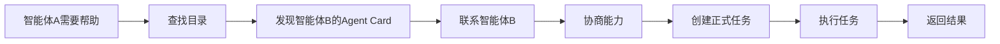
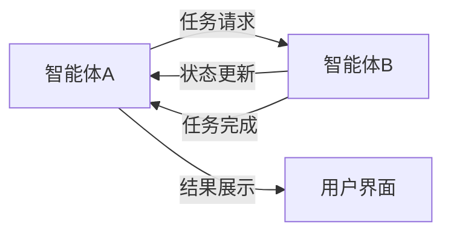

今天，我们要深入探讨谷歌创造的一个叫做 **A2A** 的东西。听起来很酷，可能还有点神秘？别担心，我们会一起拆解这个东西。

## AI 智能体终于可以聊天了！像搭乐高积木一样拆解谷歌的 A2A

好吧，坦白一下。你是否曾经感觉到自己像在同时处理十几个不同的应用程序和在线工具，但它们之间似乎都无法互相沟通？比如，你的日历不知道你的电子邮件任务列表，而任务列表又忽略了你的项目管理工具？这让人很沮丧，对吧？现在，想象一下这种挫败感在人工智能领域被放大了。你拥有所有这些超级聪明的 AI "智能体" —— 专门设计用于执行特定任务的软件片段 —— 但让它们 *协同工作* 就像试图驱赶猫一样困难。每个智能体都说着自己的语言，住在自己的小数字房子里，基本上对它的邻居保持沉默。直到我听说谷歌的 A2A，我的大脑才开始不再那么疼。跟着我，我会尝试解释这个东西，而不会让我们的脑袋集体爆炸。

## 揭秘A2A：AI世界的"万能翻译官"

那么，谷歌宣布的这个 A2A 到底 *是* 什么呢？（显然是在 2025 年 4 月，时间过得真快！）官方来说，它代表 **Agent-to-Agent**（或者如果你喜欢花哨的话，可以叫 Agent2Agent）。忘记其他 "A2A" 的含义，比如 "Account-to-Account" 银行转账 —— 这完全是关于 AI 团队合作的。

这样想：想象一个巨大的国际会议中心，里面挤满了来自不同国家的专家（我们的 AI 智能体），每个人都只说自己的母语。一片混乱，对吧？现在，想象一下谷歌推出了一种 **通用翻译设备** *和* 一个 **标准化的活动日程格式** *和* 一个 **数字目录**，列出了谁做什么。突然之间，法国工程专家可以与日本物流大师合作，巴西营销专家可以与德国数据分析师协调。 *这就是* A2A 的感觉。它是一套开源的规则 —— 一种共同的语言和协议 —— 旨在让 AI 智能体，无论谁构建的，或者它们位于何处（在不同的平台或云端），都可以真正地沟通，理解彼此的技能，并共同完成复杂的任务。谷歌正在试图为 AI 智能体建立一个联合国。

## 为什么A2A这么香？让AI们变身超级英雄联盟

"好吧，Ricky，" 你可能会想，"AI 通用翻译听起来不错，但为什么 *我* 要关心呢？" 问得好！虽然你可能不会在明天就建立起多智能体 AI 帝国，但这些东西很重要，因为它为 *每个人* 更顺畅、更智能、更集成的 AI 体验铺平了道路。

想象一下，客户服务中的聊天机器人不仅仅回答基本问题，而且可以实时与计费系统智能体 *和* 物流跟踪智能体协调，以彻底解决你的问题。想想企业如何自动执行超级复杂的工作流程 —— 例如管理整个供应链 —— 由不同的专业 AI 智能体无缝传递任务。这意味着对我们用户来说潜在的麻烦更少，对企业来说效率更高（这 *可能* 意味着更好的服务或价格？），坦率地说，它为开发者打开了一扇门，让他们可以构建更酷、更强大的 AI 应用程序，而无需花费大量时间仅仅试图将各个点连接起来。这是关于从孤立的 AI 工具转向真正协同的 AI 系统。

## 拆解A2A：就像给AI发名片一样简单

让我们稍微具体一点，但仍然坚持用人类的语言。A2A 实际上是如何让这些 AI 智能体好好相处的呢？

从根本上讲，A2A 基于几个关键思想。首先，是 **"Agent Card"（智能体名片）** 的概念。把它想象成 AI 智能体的名片或 LinkedIn 个人资料，但采用标准化的数字格式（JSON，对于技术好奇者）。这张卡片告诉其他智能体："嗨，我是智能体 X，这是联系我的方式，这是我擅长的（我的'技能'或'能力'），这是你如何证明你有权和我交谈（身份验证）。" 这样，智能体就可以 *发现* 彼此，并弄清楚谁可以帮助做什么。

接下来，一切都围绕着 **"Tasks"（任务）**。当一个智能体（我们称之为智能体 A）需要另一个智能体（智能体 B）做某事时，它不会只是对着虚空大喊大叫。它使用 A2A 规则创建一个正式的 "Task" 请求。这个任务有一个明确的目标、说明和一个生命周期（比如 "已开始"、"进行中"、"已完成"、"哎呀，失败了"）。智能体 B 接受任务，执行任务，并且可以发送回更新或最终结果（称为 "Artifact"）。这可以是任何东西 —— 文本、数据、图像，任务所需的任何东西。

整个过程使用常见的 Web 技术，如 HTTP 和 JSON，以及一些特定的协议，如 JSON-RPC（一种远程调用函数的方式）和 Server-Sent Events（SSE，用于获取实时更新，而无需不断询问"你完成了吗？"）。

**所以，记住关于 A2A 的这些关键点：**

* **Universal Translator（通用翻译器）：** AI 智能体的通用语言（协议）。
* **Agent Business Cards（智能体名片）：** 智能体使用 "Agent Cards" 来宣传他们的技能。
* **Job Orders（工作指令）：** 通过定义的 "Tasks" 管理工作。
* **Open & Standard（开放与标准）：** 它是开源的，并且基于现有的 Web 标准。
* **Teamwork Focus（团队合作重点）：** 专门设计用于智能体在不同系统之间进行协作。

## 跟着Ricky学A2A：从相亲到合作的四步曲

好的，我们不会在这里编写代码，但让我们通过 *流程* 来了解两个智能体如何使用 A2A，使用我们值得信赖的类比。想象一下智能体 A（你的客户支持聊天机器人）需要智能体 B（计费系统智能体）来检查付款状态。

* ### 第一步：智能体发现机制

  * 智能体 A 意识到它无法自己检查计费详情。它需要帮助。
  * 它查阅目录（或者使用 A2A 内的发现机制）来寻找擅长 "计费查询" 的智能体。
  * 它找到了智能体 B 的 "Agent Card"，其中列出了它的能力以及如何安全地联系它。想象智能体 A 在数字电话簿中查找智能体 B 并检查其资格。

* ### 第二步：能力查询与协商

  * 智能体 A 使用 Agent Card 中的地址联系智能体 B。
  * 它可能会询问（使用 A2A 协议）："嘿，智能体 B，我的用户 [用户 ID] 想知道订单 [订单 ID] 的付款状态。你能处理这种类型的请求吗？"
  * 智能体 B 根据其卡片上列出的技能检查请求，并确认："是的，我可以做到。发送给我的正式任务。"

* ### 第三步：任务启动与执行

  * 智能体 A 使用 A2A 格式正式创建 "Task"。此 Task 包括用户 ID、订单 ID、具体问题（"查询付款状态"）以及一些安全凭证。
  * 智能体 A 将此 Task 发送给智能体 B。
  * 智能体 B 接受 Task 并开始工作。它可能会访问其内部计费数据库（它自己的秘方）。

* ### 第四步：结果反馈与完成

  * 当智能体 B 正在工作时（特别是如果花费超过一秒），它可能会使用 A2A 的实时功能（如 SSE）将状态更新发送回智能体 A："任务正在进行中……"
  * 一旦智能体 B 找到付款状态，它会将结果（例如，"已支付"、"待处理"、"逾期"）打包到 "Artifact

## 你肯定在想：等等，让我问个问题

我打赌你现在脑子里已经冒出了一堆问号！让我来回答一下你最想问的：

* **"等等，A2A是智能体界的'普世语言'吗？其他AI就不能互相聊天了？"**

    哈！当然不是啦！这就像人类世界的语言一样，除了英语，我们还有世界上其他精彩的语言，对吧？AI世界也一样！比如Anthropic家的MCP（它更专注于给模型提供各种趁手的工具），还有LangChain的那套"黑话"（主要在它自己的地盘上用）。A2A更像是要打造一个"AI联合国"，建立一个所有AI都能用的标准，有点像互联网界的HTTP协议。而且这些不同的"语言"完全可以一起用，让AI世界更热闹！

* **"听起来很酷，但安全吗？AI们互相分享数据，总感觉有点慌..."**

    这个问题问得好！别担心，A2A可不是让AI们在后院随便聊天。它就像一个设计严密的外交协议，有着严格的安全规则和数据保护措施。每个AI在分享信息之前都要先"出示证件"，确保万无一失。

## A2A协议的实际用法案例

A2A（Agent2Agent）协议已被多家企业和平台集成，用于实现AI智能体之间的跨平台协作。以下是一些典型的实际用法场景：

1. **企业自动化与跨系统协作**
   * 招聘流程自动化：HR智能体通过A2A与简历筛选、面试安排、背景调查等智能体协作，实现全流程自动化。
   * 客户服务：客服AI通过A2A与计费、物流、知识库等智能体实时协作，自动完成复杂客户请求处理。

2. **跨厂商/平台的智能体互操作**
   * SaaS平台集成：A2A协议被Atlassian、Salesforce、ServiceNow等SaaS巨头采纳，实现Jira与Slack、GitHub等外部智能体协作。
   * 金融与财务自动化：Intuit等公司通过A2A让财务AI与银行、税务、CRM等智能体协作，实现自动对账、报税、客户数据同步等。

3. **长时任务与异步协作**
   * 供应链管理：A2A支持长时任务和实时状态更新，供应链AI可发起"采购-发货-入库"全链路任务，A2A协议保证各环节智能体异步协作、状态同步。

4. **开发者与开源社区**
   * LangChain等开源框架：开发者可用A2A协议让自己构建的AI智能体与社区其他智能体互操作，快速组装多智能体应用。

> 这些用法案例均基于A2A协议的核心能力：智能体名片（Agent Card）发现、任务（Task）生命周期管理、实时协作与安全认证。

**参考资料：**

* [Google Developers Blog: Announcing the Agent2Agent Protocol (A2A)](https://developers.googleblog.com/en/a2a-a-new-era-of-agent-interoperability/)
* [A2A官方GitHub](https://github.com/google/A2A)
