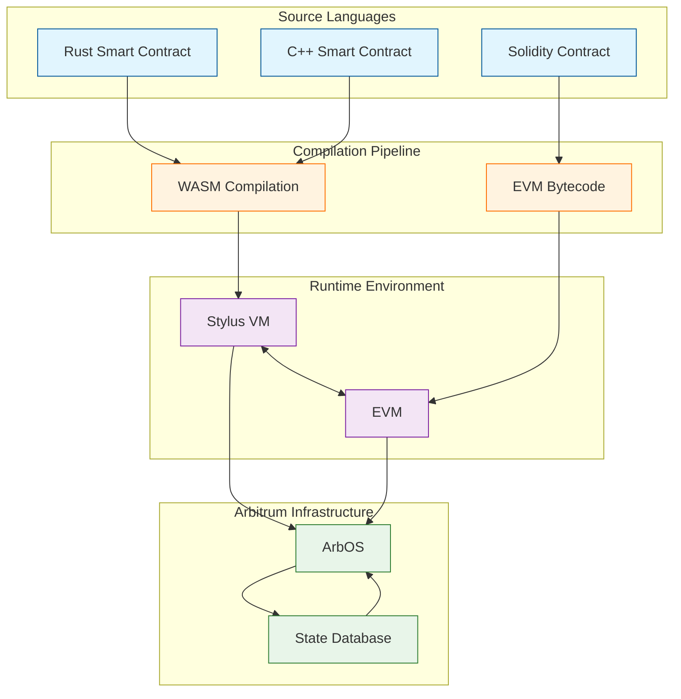

> **速览**：Arbitrum Stylus 是一个技术突破，允许用 Rust、C++ 等主流语言写智能合约，编译成 WASM 在 Arbitrum 上运行，使计算成本降低高达86%，性能暴增10-100倍。同时保持与现有 EVM 智能合约的完美互操作性。

## 老铁们！Arbitrum 又搞了个大动作

"家人们谁懂啊，写智能合约这件事一直是区块链世界的'专业活'——以前主要用 Solidity。现在好了！Arbitrum 团队放出大招 Stylus，让你可以用 Rust、C++ 来写智能合约了！这波操作我只能说：泰！裤！辣！ (￣▽￣)~"

Stylus 到底是个啥？简单来说，它就是在 Arbitrum 上加了一个 WebAssembly（WASM）虚拟机，和原来的 EVM（以太坊虚拟机）和平共处。这就像是一家餐厅原来只提供中餐，现在又加了西餐菜单，但两边的厨师可以互相协作，想吃啥点啥！

## Stylus 的技术架构

我知道一提技术架构，很多老铁就开始头晕了。别急，Ricky 带你用最简单的方式理解这套系统：

想象 Arbitrum 是个大型游乐场，以前只有一个"EVM 游乐设施"（只能玩 Solidity 游戏）。现在他们又建了个"WASM 游乐设施"（可以玩 Rust、C++、C 游戏）。两个设施共用一个中央控制室（ArbOS），游客可以随意在两边走动（互操作性）。

为了让大家看得更明白，我画了个简单的图：

## Stylus vs EVM：这是一场屠杀级的性能差距！(ಡωಡ)

当我对比 Stylus VM 和传统的 EVM 时，这不是普通的升级，这是降维打击啊！来，瞅瞅这波数据：

看到没？用 Stylus 写智能合约，计算速度比 EVM 快 10-100 倍，内存操作快 100-500 倍！用 Rust 写的密码学操作比 Solidity 省 75% 的 Gas 费。这就像是你家里的老爷机和顶配游戏本的区别！

> **奶思！**: 比如你想在区块链上验证一个高级密码学证明，用 Solidity 算一次，Gas 费可能要你吃土一个月；用 Rust 写同样的功能，省下的钱够你吃一个月外卖！

## WASM 里到底有啥黑科技？

很多老铁可能好奇，为啥 WASM 这么猛？这里面有几个关键点：

1. **编译器优化**：Rust 和 C++ 的编译器经过几十年的优化，比 Solidity 的编译器不知道高到哪里去了。就像一辆保时捷和一辆拖拉机的差别。

2. **零知识证明**：这个概念听起来很高大上，但其实就是"我知道答案但不告诉你具体是什么，只证明我真的知道"。比如，我能证明我知道你钱包密码，但不需要告诉你密码是啥。在 WASM 上跑这种证明，效率高得多。

3. **内存安全**：Rust 语言的安全特性可以在编译期就捕获大量错误，就像有个贴身保镖提前帮你挡住大部分危险。而 Solidity，嗯...就像是骑摩托不戴头盔。

## Stylus 能带来哪些神仙操作？

说真的，有了 Stylus，很多以前因为性能问题做不了的事情，现在都能搞了！看看这些可能性：

1. **高性能 DeFi**：可以实现更复杂的金融产品，比如高频交易算法。传统 EVM 上这么搞，Gas 费能把你吃破产；Stylus 上就像喝水一样简单。

2. **区块链游戏**：以前在链上做游戏逻辑，卡得像 PPT。现在可以在链上实现更复杂的游戏物理和逻辑，流畅度大幅提升。

3. **零知识应用**：可以高效地在链上验证各种复杂计算，为隐私保护和扩容提供更多可能。

4. **AI/ML 应用**：可以在链上运行一些轻量级的 AI 模型。想象一下，智能合约自己会思考了，这画面太美不敢看！

## 开发者体验：从"精英俱乐部"到"全民狂欢" O(∩_∩)O

Stylus 最大的贡献可能是降低了区块链开发的门槛。以前想写智能合约？先学 Solidity，这门语言除了区块链基本没别的用途。现在？

- 会 Rust 的后端大佬可以直接杀进来
- C++ 老炮儿们可以轻松上手
- 大量现成的库和工具可以复用

想象一下，突然间全球几百万 Rust 和 C++ 开发者可以无缝进入区块链世界，这波人才涌入会带来什么？我只能说，区块链应用的创新曲线可能会像坐火箭一样！

## 结语：Arbitrum 这波操作，真香

老铁们，从技术角度看，Stylus 对 Arbitrum 生态系统的影响绝对是革命性的。它不仅提供了显著的性能提升和成本节约，更重要的是打开了一扇大门，让更多开发者和更多类型的应用能够在区块链上实现。

作为你们的吃瓜特派员 Ricky，我只能说：Arbitrum 这波操作，资本看了都得摇头感叹——这瓜，保熟！对于这次技术升级，你有什么想法？是准备学 Rust 入场，还是继续坚守 Solidity 阵地？评论区见！

### References

1. **A gentle introduction to Stylus**. [https://docs.arbitrum.io](https://docs.arbitrum.io/stylus/gentle-introduction)
2. **Arbitrum Stylus: Now Live on Mainnet**. [https://blog.arbitrum.io](https://blog.arbitrum.io/arbitrum-stylus-mainnet)
3. **Alternative Virtual Machines in Decentralized Networks**. [https://limechain.tech](https://limechain.tech/blog/alternative-virtual-machines-in-decentralized-networks-a-benchmark-of-on-chain-performance)
4. **Arbitrum Stylus Gas Efficiency Test**. [https://docs.welldonestudio.io](https://docs.welldonestudio.io/tutorials/arbitrum-stylus-benchmark)
5. **Gas metering**. [https://docs.arbitrum.io](https://docs.arbitrum.io/stylus/concepts/gas-metering)
6. **Ways Arbitrum Stylus Mainnet Boost CVEX Performance**. [https://cvex.xyz](https://cvex.xyz/post/cvex-x-arbitrum-stylus-whats-new-for-traders)
7. **Stylus execution path**. [https://docs.arbitrum.io](https://docs.arbitrum.io/how-arbitrum-works/state-transition-function/stylus-execution-path)
8. **Arbitrum, Optimistic Rollups, and Nitro Stack: Ethereum L2**. [https://blog.quicknode.com](https://blog.quicknode.com/arbitrum-nitro-explained)
9. **Architecture overview**. [https://docs.arbitrum.io](https://docs.arbitrum.io/stylus/concepts/how-it-works)
10. **Arbitrum Stylus Paradigm Shift**. [https://medium.com](https://medium.com/@estheraladioche569/arbitrum-stylus-paradigm-shift-95e62c035a95)
11. **Arbitrum Stylus: A New Standard for Smart Contract**. [https://fishyonchain.medium.com](https://fishyonchain.medium.com/arbitrum-stylus-a-new-standard-for-smart-contract-composability-2c5c3679ca20)
12. **Step by step tutorial on how to get started with Arbitrum Stylus**. [https://medium.com](https://medium.com/@estheraladioche569/step-by-step-tuttorial-on-how-to-get-started-with-arbitrum-stylus-7de577336231)
13. **Arbitrum Stylus: Why We're Excited**. [https://www.caldera.xyz](https://www.caldera.xyz/blog/arbitrum-stylus-why-we-re-excited)
14. **OffchainLabs/stylus-sdk-rs: Rust Smart Contracts on Arbitrum**. [https://github.com](https://github.com/OffchainLabs/stylus-sdk-rs)
