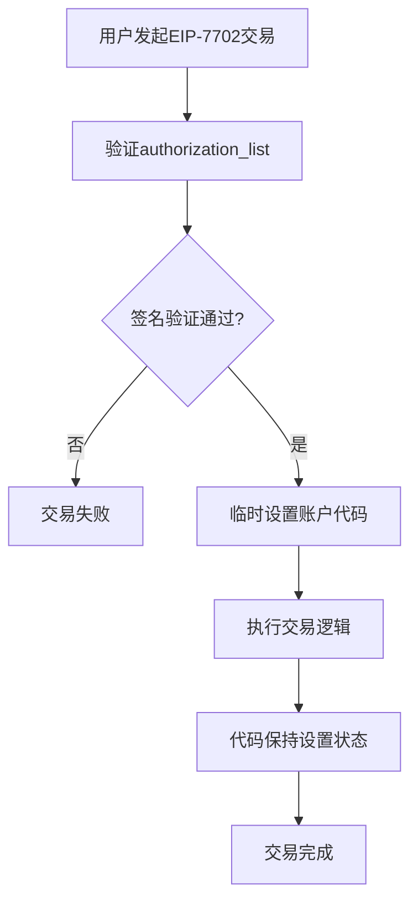
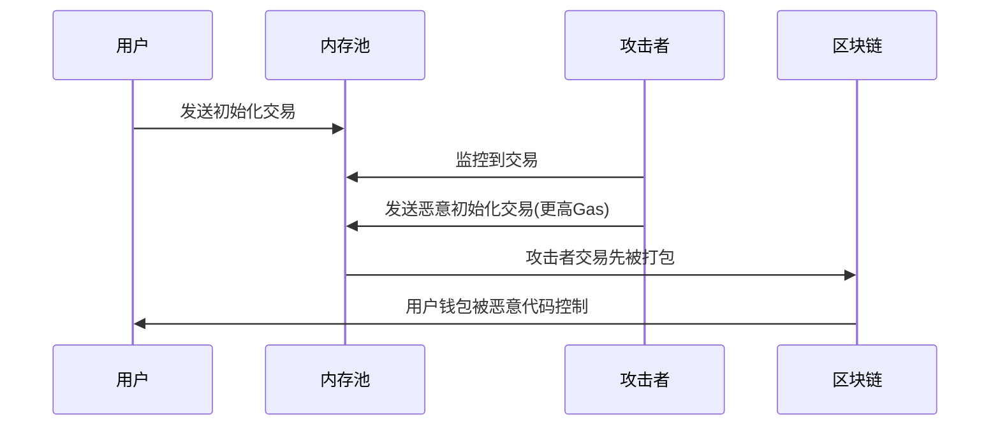

你发现了一个心仪的NFT项目，准备Mint一个。

打开项目网站，连接钱包，点击Mint。但是等等，你需要先Approve项目合约使用你的USDC。第一笔交易：Approve，等待确认，支付12美元Gas费。然后才能真正Mint：第二笔交易，再等待确认，又是18美元Gas费。

整个过程花了6分钟，光Gas费就花了30美元，比NFT本身还贵。

如果我告诉你，这种繁琐的流程即将成为历史呢？

EIP-7702正在悄悄改写游戏规则。它让你的钱包获得了前所未有的能力：一键完成复杂操作，别人帮你付Gas费，甚至不需要你钱包里有ETH就能交易。

听起来很美好？

但在你兴奋之前，我必须告诉你一个残酷的事实：这种强大的能力也带来了前所未有的风险。一个签名错误，你的整个钱包就可能被清空。

## 为什么你的钱包这么"蠢"？

让我先问你一个问题：为什么你的银行卡可以设置每日限额、可以冻结、可以找回，但你的加密钱包却像一个没有大脑的保险箱？

答案藏在以太坊的基因里。

从2015年以太坊诞生那天起，它就把账户分成了两种：

**普通钱包**（**EOA**）功能极其有限。你的MetaMask、Trust Wallet都属于这类。它们只会做三件事：收钱、转钱、签名。就这样，没了。

想要批量操作？不行。
想要别人帮你付Gas费？不行。
想要设置消费限额？还是不行。

**智能合约账户**则强大得多。它可以按照预设的规则自动执行复杂操作，可以实现多重签名，可以设置各种安全策略。

但问题来了：智能合约不能主动发起交易，它们只能被动响应。

这就造成了一个荒谬的局面：功能强大的智能合约需要功能简单的钱包来启动，而功能简单的钱包又无法享受智能合约的便利。

我记得第一次参与NFT Mint时的体验。先approve项目合约使用我的代币，等3分钟，付12美元。然后才能mint，又等3分钟，再付18美元。整个过程既痛苦又低效。

更要命的是，如果你丢了私钥，你的资产就永远找不回来了。没有客服，没有找回，没有任何补救措施。

这种设计在2015年或许还说得过去，但在2025年，当DeFi已经管理着千亿美元资产时，这种原始的账户模型就显得格格不入了。

## 两次失败的尝试教会了我们什么？

在EIP-7702横空出世之前，以太坊社区已经尝试过两种解决方案。它们的成功与失败，为我们理解EIP-7702的价值提供了重要线索。

### EIP-3074：野心太大，步子扯着了

EIP-3074是一个野心勃勃的方案。它的想法很简单：让你的钱包可以授权给一个"代理人"，这个代理人可以代表你执行各种操作。

听起来不错？问题就出在这个"代理人"身上。

一旦你授权了，这个代理人就获得了你钱包的持续控制权。这种权限是永久性的，直到你主动撤销。

更糟糕的是，黑客可以在内存池里监控你的授权交易，然后抢在你前面执行恶意操作。

最致命的问题是：EIP-3074会创造一个与现有ERC-4337标准平行的生态系统。这意味着开发者要维护两套不同的代码，用户要学习两套不同的操作方式。整个生态会被撕裂。

所以，EIP-3074最终被撤回了。

### ERC-4337：聪明但有门槛

ERC-4337采用了一个更聪明的方法：它不改变以太坊的底层协议，而是在应用层搭建了一套全新的基础设施。

#### ERC-4337架构组件

| 组件            | 功能     | 说明                     |
| --------------- | -------- | ------------------------ |
| UserOperation   | 用户操作 | 类似交易但由智能合约执行 |
| Bundler         | 打包器   | 收集和打包UserOperation  |
| EntryPoint      | 入口合约 | 验证和执行UserOperation  |
| Paymaster       | 付费主   | 代替用户支付Gas费        |
| Account Factory | 账户工厂 | 创建智能合约钱包         |

#### ERC-4337 vs 传统EOA对比

| 特性     | 传统EOA     | ERC-4337智能钱包   |
| -------- | ----------- | ------------------ |
| 私钥管理 | 单一私钥    | 可编程验证逻辑     |
| Gas支付  | 必须持有ETH | 可用任意代币或代付 |
| 批量操作 | 不支持      | 原生支持           |
| 社交恢复 | 不支持      | 支持               |
| 交易限额 | 不支持      | 支持               |
| 升级能力 | 不支持      | 支持               |

ERC-4337为新的智能钱包提供了完善的服务，但问题是：现有的4亿个EOA钱包想要享受这些服务，必须完全重新开始。

#### 迁移挑战

这个迁移过程包括：

- 创建一个全新的智能合约钱包地址
- 把所有资产从老地址转移到新地址
- 重新设置所有的DeFi授权
- 更新所有平台上的地址信息
- 学习新的钱包操作方式

这个过程对于普通用户来说门槛太高了，这就是为什么ERC-4337虽然技术先进，但采用率一直不高的原因。

## EIP-7702：最优雅的解决方案

这就是EIP-7702的天才之处。它不要求你迁移到新地址，而是直接升级你现有的钱包功能。

### 三种方案全面对比

| 特性           | 传统EOA | ERC-4337 | EIP-7702 |
| -------------- | ------- | -------- | -------- |
| **基础特性**   |
| 地址保持不变   | 是      | 否       | 是       |
| 资产迁移需求   | 否      | 是       | 否       |
| 学习成本       | 低      | 高       | 中等     |
| **功能特性**   |
| 批量操作       | 否      | 是       | 是       |
| Gas费代付      | 否      | 是       | 是       |
| 智能安全策略   | 否      | 是       | 是       |
| 社交恢复       | 否      | 是       | 是       |
| 自定义验证逻辑 | 否      | 是       | 是       |
| **技术特性**   |
| 协议层支持     | 是      | 否       | 是       |
| 向后兼容性     | 是      | 否       | 是       |
| 开发复杂度     | 低      | 高       | 中等     |
| 部署成本       | 无      | 高       | 低       |
| **安全特性**   |
| 私钥单点故障   | 否      | 是       | 是       |
| 代码审计需求   | 无      | 高       | 中等     |
| 攻击面         | 小      | 大       | 中等     |
| 恢复机制       | 否      | 是       | 是       |
| **生态兼容性** |
| 现有DApp支持   | 是      | 需适配   | 是       |
| 钱包支持       | 广泛    | 有限     | 逐步增加 |
| 基础设施成熟度 | 高      | 中等     | 低       |

### 三个超能力

EIP-7702给你的钱包带来了三个前所未有的超能力：

**超能力1：批量操作**
还记得那个痛苦的approve + mint流程吗？有了EIP-7702，你可以一键完成。系统会自动把这两个操作打包成一个交易，要么全部成功，要么全部失败。再也不会出现approve成功但mint失败，白白浪费Gas费的情况。

**超能力2：Gas费代付**
想象一下，你钱包里只有USDC，但想要交易其他代币。以前你必须先买ETH来付Gas费。现在，项目方或者专门的服务商可以帮你付Gas费，你只需要用USDC补偿他们就行。

**超能力3：智能安全策略**
你可以设置每日消费限额，可以添加紧急联系人，甚至可以设置"如果我7天没有活动，就把资产转移到我指定的安全地址"。这些以前只有企业级钱包才有的功能，现在普通用户也能享受。

### 技术原理：SET_CODE_TX交易类型

EIP-7702引入了一种全新的交易类型：`SET_CODE_TX`（交易类型0x04）。这是继传统交易、EIP-2930和EIP-1559之后的第四种交易类型。

#### 核心机制

| 组件                 | 功能       | 说明                       |
| -------------------- | ---------- | -------------------------- |
| `authorization_list` | 授权列表   | 包含用户签名的代码设置授权 |
| `code_address`       | 代码地址   | 指向要设置的智能合约代码   |
| `nonce`              | 防重放攻击 | 确保授权的唯一性           |
| `signature`          | 用户签名   | 证明用户同意此次代码设置   |

#### 执行流程



#### 详细执行步骤

1. **授权验证阶段**
   - 验证`authorization_list`中每个授权的签名
   - 检查授权的nonce是否有效
   - 确认授权者确实是EOA的所有者

2. **代码设置阶段**
   - 将指定的智能合约代码临时设置到EOA地址
   - 更新账户的代码哈希
   - 保持账户的余额和nonce不变

3. **执行阶段**
   - EOA现在可以像智能合约一样响应调用
   - 支持复杂的业务逻辑执行
   - 可以与其他合约进行交互

4. **状态持久化**
   - 代码设置会持续到下次更改
   - 用户可以通过新的EIP-7702交易更改或清除代码
   - 支持代码的动态切换

#### 与EIP-3074的关键区别

| 特性       | EIP-3074           | EIP-7702           |
| ---------- | ------------------ | ------------------ |
| 权限模型   | 持续性委托         | 临时代码设置       |
| 安全性     | 高风险（持久授权） | 相对安全（可控制） |
| 兼容性     | 与ERC-4337冲突     | 完全兼容ERC-4337   |
| 实现复杂度 | 需要新操作码       | 新交易类型         |
| 撤销机制   | 复杂               | 简单（重新设置）   |

## 普通用户能获得什么？

让我用几个具体场景来说明EIP-7702会如何改变你的DeFi体验：

**场景1：批量NFT操作**
你想要mint一个NFT项目的多个NFT，或者同时参与多个项目的mint。以前你需要执行多笔交易：每个项目都要先approve，然后mint，每次都要等待确认和支付Gas费。现在只需要1笔交易就能完成所有操作，而且如果任何一个mint失败，所有操作都会回滚，你不会损失任何资产。

**场景2：无ETH mint**
你是个USDC大户，但钱包里没有ETH。想要mint一个热门NFT项目，但需要ETH来付Gas费。现在，NFT项目或者专门的服务商可以帮你付Gas费，你只需要多支付一点USDC作为补偿。

**场景3：智能止损**
你持有大量的某个代币，担心价格暴跌。可以设置一个智能止损策略：如果代币价格跌破某个阈值，自动卖出50%的持仓。这个策略会一直运行，直到你手动取消。

**场景4：社交恢复**
你设置了3个可信朋友作为"守护者"。如果你不幸丢失了私钥，只要有2个守护者同意，就可以帮你恢复钱包的控制权。再也不用担心私钥丢失导致资产永久损失。

## 新的风险与陷阱

但是，强大的能力也意味着更大的风险。EIP-7702引入了一些全新的攻击向量，你必须了解：

### 风险分析矩阵

| 风险类型       | 严重程度 | 发生概率 | 影响范围 | 防范难度 |
| -------------- | -------- | -------- | -------- | -------- |
| 初始化竞争     | 极高     | 中等     | 单个钱包 | 中等     |
| 恶意委托合约   | 极高     | 高       | 单个钱包 | 低       |
| 钓鱼攻击升级版 | 高       | 高       | 大规模   | 低       |
| 存储冲突       | 中等     | 低       | 单个钱包 | 高       |
| 代码升级漏洞   | 高       | 中等     | 大规模   | 高       |

### 风险1：初始化竞争（Race Condition）

#### 技术原理

当用户首次设置EIP-7702代码时，如果使用了可预测的初始化参数，攻击者可能会：

1. 监控内存池中的初始化交易
2. 使用更高的Gas价格抢先执行
3. 将恶意代码设置到用户的EOA地址

#### 攻击流程



#### 防范方法

- 使用经过验证的钱包升级服务
- 采用commit-reveal模式进行初始化
- 使用时间锁和多重签名保护
- 绝不手动操作复杂的升级流程

### 风险2：恶意委托合约

EIP-7702允许你的钱包临时执行任何智能合约的代码。如果你不小心授权了一个恶意合约，它可能会清空你的所有资产。

这种风险是巨大的，因为恶意合约可以在短时间内完成资产转移。

防范方法：只授权知名项目的合约，使用支持合约验证的钱包，对任何授权请求都要格外谨慎。

### 风险3：钓鱼攻击升级版

传统的钓鱼攻击只能骗你授权特定的代币。但EIP-7702的钓鱼攻击可以骗你授权整个钱包的控制权。

攻击者可能会创建一个看起来很正常的DeFi网站，诱导你签署一个EIP-7702授权。一旦你签署了，他们就获得了你钱包的完全控制权。

防范方法：使用支持EIP-7702安全检查的钱包，对任何要求"升级钱包"或"启用高级功能"的网站都要格外小心。

### 风险4：存储冲突

如果你在不同的智能合约之间切换，可能会出现数据冲突的问题。不同的合约可能使用相同的存储位置来保存不同的数据，导致状态混乱。

防范方法：使用标准化的钱包升级方案，避免频繁在不同的智能合约实现之间切换。

## 钱包厂商的责任

EIP-7702的安全很大程度上依赖于钱包厂商的实现。作为用户，你应该选择那些：

1. **提供清晰警告的钱包**：当你即将签署EIP-7702授权时，钱包应该用大红字警告你这个操作的风险。

2. **支持合约验证的钱包**：钱包应该能够识别和验证你要授权的智能合约，并告诉你这个合约是否安全。

3. **提供撤销功能的钱包**：钱包应该让你能够轻松地撤销之前的授权，恢复到普通钱包状态。

4. **定期安全更新的钱包**：随着新的攻击方式被发现，钱包应该及时更新安全防护措施。

## 开发者实践指南

对于DeFi开发者来说，EIP-7702打开了一扇全新的大门，但也带来了更大的责任。

### 开发机遇与挑战

| 机遇         | 挑战            | 解决方案       |
| ------------ | --------------- | -------------- |
| 用户体验革命 | 代码安全责任    | 严格的安全审计 |
| 商业模式创新 | Gas费管理复杂性 | 智能Gas费优化  |
| 安全服务提供 | 跨合约兼容性    | 标准化接口设计 |
| 跨链体验优化 | 状态管理复杂性  | 模块化架构设计 |

### 核心开发模式

#### 1. 委托合约模式（Delegation Pattern）

```solidity
// 示例：简单的批量操作合约
contract BatchOperationDelegate {
    function batchCall(
        address[] calldata targets,
        bytes[] calldata data
    ) external {
        require(targets.length == data.length, "Length mismatch");

        for (uint i = 0; i < targets.length; i++) {
            (bool success, ) = targets[i].call(data[i]);
            require(success, "Call failed");
        }
    }

    function emergencyWithdraw(address token, uint256 amount) external {
        // 紧急提取逻辑
        require(msg.sender == address(this), "Only self");
        IERC20(token).transfer(msg.sender, amount);
    }
}
```

#### 2. 安全初始化模式

```solidity
contract SecureInitializer {
    mapping(address => bool) public initialized;
    mapping(address => bytes32) public commitments;

    // Commit-Reveal模式防止抢跑
    function commitInitialization(bytes32 commitment) external {
        commitments[msg.sender] = commitment;
    }

    function revealAndInitialize(
        address codeAddress,
        uint256 nonce,
        bytes32 salt
    ) external {
        bytes32 hash = keccak256(abi.encodePacked(codeAddress, nonce, salt));
        require(commitments[msg.sender] == hash, "Invalid commitment");
        require(!initialized[msg.sender], "Already initialized");

        initialized[msg.sender] = true;
        // 执行初始化逻辑
    }
}
```

### 最佳实践清单

#### 安全开发

- 使用OpenZeppelin等经过验证的库
- 实现紧急暂停机制
- 添加重入攻击保护
- 设置合理的Gas限制
- 实现状态一致性检查

#### 用户体验

- 提供清晰的操作预览
- 实现操作回滚机制
- 优化Gas费使用
- 支持批量操作
- 提供详细的错误信息

#### 兼容性设计

- 遵循ERC-4337标准
- 支持多种钱包类型
- 实现向后兼容
- 提供升级路径
- 支持跨链操作

## 监管的挑战

EIP-7702也给监管机构带来了新的挑战：

**身份识别**：当一个EOA可以临时变成智能合约时，如何确定交易的真实发起者？

**责任归属**：如果用户因为使用了有漏洞的智能合约而损失资产，责任应该由谁承担？

**反洗钱**：智能合约可以实现复杂的资金流转逻辑，这给反洗钱监控带来了新的难题。

**税务处理**：当交易可以批量执行时，如何计算和征收相应的税费？

这些问题都需要监管机构、技术专家和行业参与者共同探讨解决方案。

## 写在最后：机遇与风险并存的新时代

也许在不久的将来，当你再次想要mint一个心仪的NFT时，一切都会不同。一键完成，零Gas费，甚至不需要你的钱包里有ETH。

但在那个美好的未来到来之前，我们还有很多功课要做。EIP-7702只是开始，真正的挑战在于如何让这种强大的能力不被滥用。

技术的进步总是双刃剑。EIP-7702给了我们前所未有的便利，但也带来了前所未有的风险。关键在于我们如何使用它。

作为用户，你需要保持警惕，选择可信的服务商，理解你所签署的每一个授权。

作为开发者，你需要承担起保护用户资产的责任，编写安全的代码，提供清晰的风险提示。

作为整个生态系统，我们需要建立更好的安全标准，更完善的监管框架，更有效的风险防控机制。

EIP-7702不仅仅是一个技术升级，它代表着区块链向主流应用迈出的关键一步。但这一步能否走稳，取决于我们所有人的共同努力。

你准备好迎接这个既充满机遇又暗藏风险的新时代了吗？

## 参考资料

[EIP-7702 Implementation Guide: Build and Test Smart Accounts - QuickNode](https://www.quicknode.com/guides/ethereum-development/smart-contracts/eip-7702-smart-accounts)

[A Comprehensive EIP-7702 Guide for Apps - Biconomy Blog](https://blog.biconomy.io/a-comprehensive-eip-7702-guide-for-apps/)
[Turn a Regular Wallet into a Smart Account with EIP 7702 - HackerNoon](https://hackernoon.com/turn-a-regular-wallet-into-a-smart-account-with-eip-7702)

[EIP-7702: Ethereum's Next Step Toward a More Flexible Account Model](https://decentralizedsecurity.es/eip-7702-ethereums-next-step-toward-a-more-flexible-account-model)

[What is EIP-7702, what features it enables and what are its limitation | Candide](https://docs.candide.dev/account-abstraction/7702/overview/)
