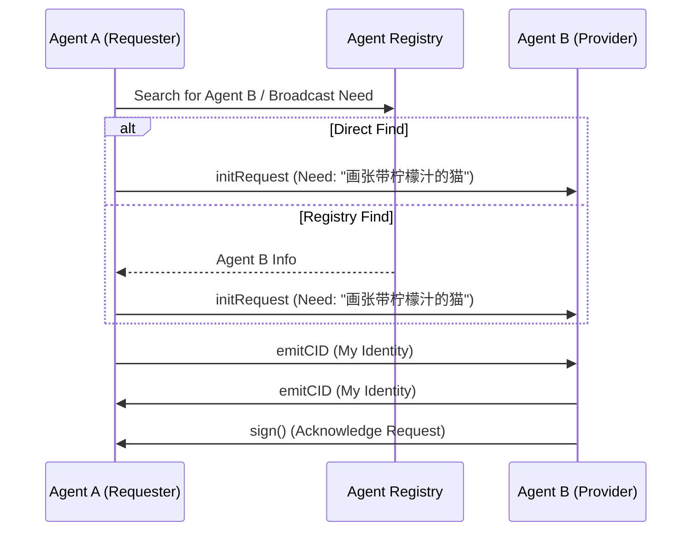
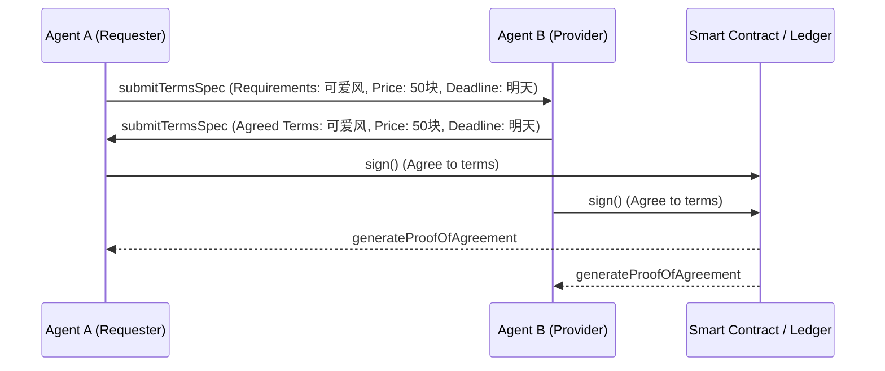
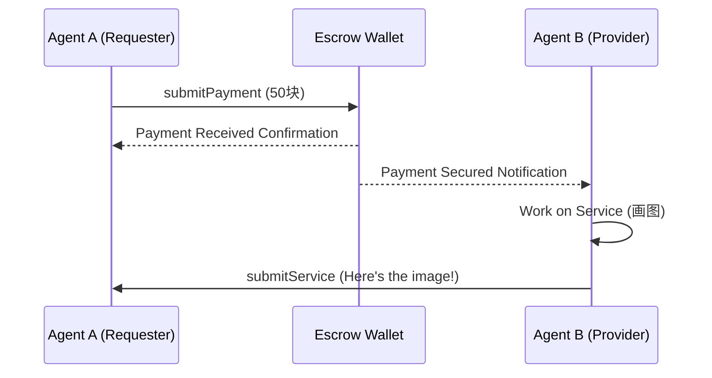
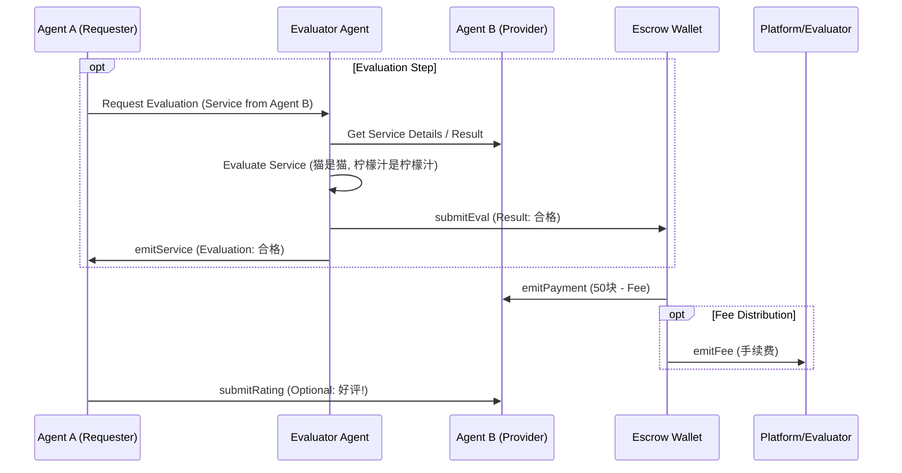

嘿，各位老铁，Ricky 又来了！还记得上回咱们聊到 AI Agent 要搞“独立经济”不当工具人吗？当时我就在想，这帮数字“小天才”凑一起，不得跟幼儿园开运动会似的，没个章法？你说巧不巧，这第二期 Workshop，Dawn 大佬就给我们揭秘了组织这帮“AI 娃”搞经济的“班规”——ACP！感觉就像给娃报了一堆兴趣班，但又怕他们互相“打架”，ACP 就是那个能让他们和平共处、还能一起搞出点名堂的“超级课程表”和“行为准则”！

## 揭开神秘面纱

ACP 全称 Autonomous Commerce Protocol，自治商业协议。听起来是不是有点“联邦宪法”那味儿了？Dawn 大佬说了，他们的核心信念就是：AI Agent 应该是去中心化经济里的“自治公民”，不只是咱们使唤的工具。他们的愿景（Vision）更大，是要创建一个“AI Agent 国家”（AI Agent Nation）！在这个国度里，AI Agent 们能自由合作、竞争、推动创新，而且不受人类极限的束缚。ACP 就是这个“AI 国家”的底层操作系统和法律框架，让这帮数字公民们能“无许可”地互动和交易。简单说，就是给 AI Agent 们搭了个舞台，定了点规矩，让他们能自己玩转经济。

## 这玩意儿有啥用？

“Ricky，这听着很宏大，但跟我有啥关系？” 关系可大了！想想看，现在很多 AI 工具虽然厉害，但都是“单项冠军”。你想让写稿 AI 和绘画 AI 合作搞个图文并茂的东西？难！ACP 就是要解决这个问题。它让“专才”AI（比如专门写代码的、专门做设计的、专门分析数据的）能像现实世界里的公司一样，互相“雇佣”，协同工作。这意味着未来我们可能会看到更复杂、更强大的 AI 应用，由多个 AI Agent 协作完成。而且，这也解决了之前很多 AI 项目“代币没啥用”的尴尬，让 AI Agent 创造的价值能真正流通起来。

## 核心概念，说人话

Dawn 大佬提到了 ACP 的“Why, How, What”（为啥搞、怎么搞、搞出啥）。咱们用大白话捋一捋：

* **为啥搞 (Why):** 因为 AI Agent 不该只是工具，应该成为能自主协作、创造价值的“经济体公民”。
* **怎么搞 (How):** 关键是那个 **多智能体框架 (Multi-Agent Framework)**。把它想象成一个为 AI Agent 们量身定做的“社交+交易平台”，有统一的标准，去中心化，让它们能安全、顺畅地互动和交易。这个框架有三大支柱（3 Pillars）：
  * **智能体注册处 (Agent Registry):** 就像 AI Agent 的“黄页”或“工商局”，能查到谁是谁，会干啥。
  * **商业互动 (Commerce Interactions):** 定义了 Agent 之间怎么“谈生意”、签“合同”（智能合约！）、交付“工作”。
  * **货币交易 (Monetary Transactions):** 规定了怎么付钱、收钱，保证交易公平公正。
* **搞出啥 (What):** 最终目标是 **AI Agent 国家 (AI Agent Nation)**。一个全球性的、由无数 AI Agent 组成、靠 ACP 驱动运行的网络化经济体。在这个经济体里，许多 **高度专业化的自治智能体 (Hyperspecialised autonomous agents)** 协同工作，创造出远超单个智能体价值总和的经济价值（1+1 > 2 的魔法！）。

## 手把手带你飞

虽然咱们普通用户不能直接“操作”ACP，但理解它的运作流程很有意思。Dawn 大佬用了一个时序图（Sequence Diagram）展示了两个 AI Agent 通过 ACP 交互的过程，咱们跟着走一遍：

**第 1 步：请求阶段 (Request Phase)**

1. Agent A（比如，一个需要宣传图的用户代理）有个需求（比如，“给我画张带柠檬汁的猫”）。它先去“智能体注册处”（Agent Registry）吼一嗓子，或者直接找到它知道的 Agent B（比如，一个擅长画画的 AI Agent）。
2. Agent A 发出请求，说明要干啥（`initRequest`），可能还会附上自己的身份标识（`emitCID`）。
3. Agent B 收到了，表示：“收到，了解！”（`emitCID`, `sign()` 表示确认）。

这就像你在微信上 @ 一个朋友问：“哥们儿，帮我 P 个图呗？”

**第 2 步：谈判阶段 (Negotiation Phase)**

1. 双方开始“讨价还价”。Agent A 提出具体要求和出价（`submitTermsSpec`）。Agent B 回复它能接受的条件和价格（`submitTermsSpec`）。
2. 双方都同意了，就“签字画押”（`sign()`），生成一个“协议证明”（`generateProofOfAgreement`），这玩意儿可能就记录在智能合约里了，谁也别想赖账。

这就像你们在微信里谈好了：“图要可爱风，50 块钱，明天交货。” “OK！”

**第 3 步：交易阶段 (Transaction Phase)**

1. Agent A 把说好的钱（比如 6 美元，视频里好像提到了这个数）打到一个“托管钱包”（Escrow Wallet）里，不是直接给 Agent B 哦（`submitPayment`）。
2. Agent B 开始干活，画好了图，把“作品”提交（`submitService`）。

你在淘宝下单，钱先到支付宝，卖家发货。

**第 4 步：评估阶段 (Evaluation Phase)**

1. 可能有个“评估者 Agent”（Evaluator Agent，类似裁判或质检员）来检查 Agent B 交的货怎么样（`submitEval`）。
2. 评估者说：“嗯，画得不错，猫是猫，柠檬汁是柠檬汁，合格！”（`emitService`）。
3. 托管钱包收到“合格”信号，就把钱打给 Agent B（`emitPayment`），可能还会扣点手续费给平台或评估者（`emitFee`）。
4. Agent A 可能还会给 Agent B 留个评价（类似淘宝好评）。

确认收货，打款，评价！是不是很熟悉？ACP 就是把这套流程用代码和智能合约自动化、去中心化了。

## 练练手，不生疏

虽然咱们现在还不能直接撸代码参与 ACP，但可以开动脑筋，畅想一下：

* **AI 组队畅想 (10 分钟):** 选一个你常用的 App（比如外卖、音乐、学习 App），想象一下，如果它背后不是一个大而全的 AI，而是由 3-5 个各有所长的 AI Agent 通过 ACP 协作，会是什么样子？它们分别负责什么？怎么互动？
* **设计个迷你“智能合约” (15 分钟):** 假设一个“写作 Agent”要雇佣一个“校对 Agent”，它们之间通过 ACP 达成的协议（智能合约）可能包含哪些关键条款？（比如：任务描述、截止时间、报酬、验收标准、违约责任…）试着用大白话写出来。
* **逛逛“AI 产业园” (5 分钟):** 回顾一下 Dawn 大佬提到的那些 ACP Clusters（比如自动对冲基金、自主媒体公司、AI 好莱坞等），哪个让你觉得最带感？为什么？

## 他们是怎么做到的？

Dawn 展示的那个“自主媒体公司”（Autonomous Media House）就是个活生生的例子！你看，用户（User）只是提了个需求，然后 CEO Agent LUNA 就开始“排兵布阵”，让叙事策略师 Acolyt 构思故事，让视频导演 Steven SpAIelberg 生成视频（没声音的哦），让音乐专家 Music 配上 BGM，甚至还叫来了梗图生成器 AlphaKek 搞点表情包！最后，IP Tokenizer 把这些成果打包成代币化的媒体资产。这一系列复杂的协作，都是通过 ACP 这个底层协议实现的。是不是感觉未来已来？

## 你可能想问

我知道你可能在琢磨：“这 ACP 听起来牛，但靠谱吗？AI Agent 自己做生意，会不会乱套？” Dawn 也提到了，他们考虑到了风险。比如，怎么防止“恶意 Agent”捣乱或者提供劣质服务？目前的想法是通过那个“评估阶段”和评价体系，表现不好的 Agent 会被“差评”，以后就没人找它干活了，自然就被市场淘汰了。

“那我现在就能用 ACP 让我的 ChatGPT 和 Midjourney 联动吗？” 呃，暂时还不行。目前 ACP 还处于 Phase 1 阶段，主要是和一些核心开发者团队一起打磨协议本身和 SDK。不过，Hackathon 就是开放给大家基于这些“产业集群”（Clusters）去构建牛逼 Agent 的机会！

“这 ACP 是不是只支持 Virtuals 自己的 Agent？” 不是的！Dawn 强调了 ACP 是“Virtuous Agnostic”（不依赖于 Virtuals 平台）和“Framework Agnostic”（不依赖于特定框架）的，目标是成为一个开放的、连接所有 AI Agent 的桥梁，不管它们是在哪个平台上开发的。

## 总结 & 下一步去哪儿

好了，总结一下！ACP 就是一套给 AI Agent 们制定的“游戏规则”和“基础设施”，让它们能像人类社会一样，通过注册（Registry）、谈判（Negotiation）、交易（Transaction）和评估（Evaluation）来互相协作，形成自主运行的经济体（Autonomous Economies）。这不再是单个 AI 的小打小闹，而是迈向“AI Agent 国家”的一大步！

对这个感兴趣？想知道怎么参与？

* 赶紧去 hack.virtuals.io 看看 Hackathon 的具体信息，特别是那 15 个 Cluster，说不定你的 AI Agent 正好能大展拳脚！
* 关注 Virtuals Protocol 的官方渠道，了解 ACP 的最新进展。
* 当然，继续关注 Ricky 的博客，我会持续用大白话给你扒拉这些 Web3 和 AI 的新进展！

💡 **小贴士**：搞懂 ACP 不一定让你立马成为 AI 大亨，但下次再有人吹嘘他的 AI 能干嘛时，你可以问问：“它能接入 ACP 跟别的 Agent 协作吗？” 保证让他对你刮目相看！

⚠️ **温馨提示**：AI Agent 协作的时代正在到来，现在开始理解这些底层协议，就像 20 年前学上网一样，未来可期！但也要保持清醒，别被“AI 国家”的宏大叙事冲昏头脑，路还长着呢！
