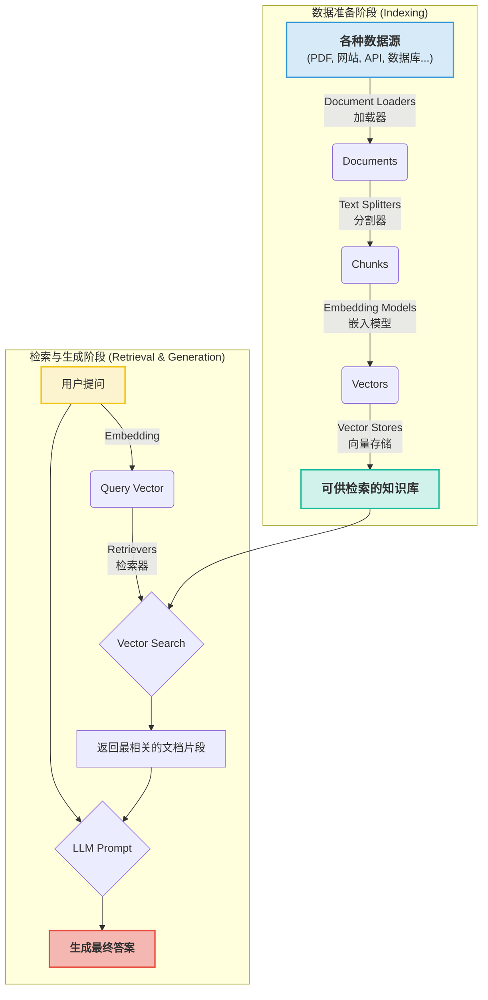

## 前言：不止于“积木”，更是“引擎”

在上一篇[《【宏观篇】LangChain的设计哲学与分层架构》](/posts/langchain-intro/)中，我们鸟瞰了 LangChain 的全貌。现在，是时候深入丛林，看看构成这片生态的“树木”了。LangChain 的魔力在于，它把开发一个复杂的 LLM 应用，变成了一场有趣的乐高游戏——你只需要把一个个标准化的“积木块”（也就是核心组件）拼搭起来。

但如果仅仅停留在“拼积木”的层面，我们可能会错失 LangChain 的精髓。这些组件不仅是静态的模块，更是驱动智能应用运转的精密“引擎部件”。

这篇文章的**深度版**，将满足你对“为什么”和“怎么做更好”的好奇心。我们将不仅介绍 **应用核心** 和 **数据连接** 这两大模块是什么，更会深挖它们背后的工作原理、高级用法以及 LangChain 是如何巧妙地实现它们的。准备好，我们开始一场深入底层的探索之旅。

---

## **一、 应用核心 (Core Logic)：驱动AI思考的大脑**

如果说 LangChain 应用是一个生命体，那“应用核心”组件就是它的大脑和神经系统。它们负责直接与语言模型（LLM）对话，并对模型的行为进行精细的编排和控制。

### **1. Models (模型接口)：与LLM对话的“标准普通话”**

这部分我们快速回顾一下：LangChain 通过 `LLMs` (输入/输出字符串) 和 `ChatModels` (输入/输出结构化消息) 两种接口，统一了与不同语言模型的交互方式，实现了 **解耦** 与 **未来兼容**。

`ChatModel` 的 `BaseMessage` 体系（`SystemMessage`, `HumanMessage`, `AIMessage`, `ToolMessage`）是现代LLM应用开发的基石，它将对话结构化，为角色扮演、工具使用和多轮记忆等高级功能铺平了道路。

### **2. Prompts (提示工程)：从“手工作坊”到“工业化生产”**

如果说与LLM沟通是一门艺术，那 LangChain 的 Prompts 组件就是将这门艺术“工业化”的生产线。它远不止是简单的字符串拼接，而是一整套用于创建、管理、优化和组合提示的强大工具。


*图2: 提示工程：驯服LLM的精密“遥控器”*

#### **深度挖掘：PromptTemplate 的组合与技巧**

`PromptTemplate` 的核心是 **逻辑与内容的分离**，但它的威力体现在 **可组合性** 上。

**A. 模板的拼接与组合 (`+`)**

你可以像拼接乐高一样，把多个提示模板组合成一个更复杂的模板。

```python
from langchain_core.prompts import PromptTemplate

prompt1 = PromptTemplate.from_template("给我讲一个关于 {animal} 的笑话。")
prompt2 = PromptTemplate.from_template("这个笑话需要是 {style} 风格的。")

# 使用 '+' 号直接拼接
combined_prompt = prompt1 + prompt2
print(combined_prompt.format(animal="猫", style="冷"))
# -> 给我讲一个关于 猫 的笑话。这个笑话需要是 冷 风格的。
```

**B. 部分格式化 (`.partial`)**

在复杂的应用中，你可能希望预先填充一部分模板变量，这在构建需要多步骤输入的链（Chain）时特别有用。

```python
from langchain_core.prompts import PromptTemplate

prompt = PromptTemplate(
    template="总结一下这段文字：{text}，并将其翻译成 {language}。",
    input_variables=["text", "language"]
)

# 预先填充 language 变量
prompt_zh = prompt.partial(language="中文")

# 之后只需要填充剩下的变量
print(prompt_zh.format(text="LangChain is a framework for developing applications powered by LLMs."))
# -> 总结一下这段文字：LangChain is a framework for developing applications powered by LLMs.，并将其翻译成 中文。
```

`.partial()` 返回的是一个新的 `PromptTemplate` 实例，这种函数式编程的风格让代码非常清晰。

**C. 结构化提示与输出解析器 (`with_structured_output`)**

这是 LangChain 中一个极其强大的功能：**强制模型输出结构化数据（如JSON）**。你只需要定义一个 Pydantic 模型（可以看作是带类型约束的Python数据类），LangChain 就会自动：

1. 从 Pydantic 模型生成格式化指令和JSON Schema。
2. 将这些指令注入到最终的提示中。
3. 在模型返回结果后，自动解析输出的JSON字符串，并填充到Pydantic对象中。

```python
from langchain_core.pydantic_v1 import BaseModel, Field
from langchain_openai import ChatOpenAI

# 1. 定义你希望输出的数据结构
class Joke(BaseModel):
    setup: str = Field(description="笑话的铺垫部分")
    punchline: str = Field(description="笑话的点睛之笔")

# 2. 将模型与结构化输出绑定
#    `with_structured_output` 会返回一个特殊的Runnable对象
structured_llm = ChatOpenAI(model="gpt-4o", temperature=0).with_structured_output(Joke)

# 3. 正常调用，但返回的是一个Pydantic对象！
joke_prompt = "给我讲一个关于程序员的笑话"
result = structured_llm.invoke(joke_prompt)

print(type(result))
# -> <class '__main__.Joke'>

print(f"铺垫: {result.setup}")
print(f"笑点: {result.punchline}")
# -> 铺垫: 为什么程序员总是把万圣节和圣诞节搞混？
# -> 笑点: 因为 OCT 31 == DEC 25 (八进制的31等于十进制的25)
```

这个功能极大地简化了从LLM输出中提取信息的流程，是构建可靠AI Agent和工具调用的基础。

### **3. Memory (记忆机制)：让LLM不再“金鱼脑袋”**

LLM 天生就是个“金鱼脑袋”，聊完就忘。`Memory` 组件就是它的“记忆海马体”，让它能记住之前的对话，真正实现有来有回的“交流”。


*图3: 记忆机制：为AI装上“海马体”*

#### **深度挖掘：记忆的工作原理与实战**

所有 `Memory` 组件都遵循一个简单的约定（或者说接口）：`load_memory_variables` (加载记忆) 和 `save_context` (保存记忆)。这个看似简单的设计，是 LangChain 将状态管理从核心逻辑中解耦的关键。

在一个带有记忆的链（Chain）中，完整的生命周期是这样的：

1. **接收输入**: 用户输入被传递给链。
2. **加载记忆**: 在调用模型 **之前**，链会调用 `memory.load_memory_variables()` 方法。这个方法会从内部存储（如一个列表、数据库）中提取历史对话，并将其格式化成一个字典（例如 `{'history': 'Human: 你好\nAI: 你好！有什么我能帮忙的吗？'}`）。
3. **填充提示**: 链将用户的当前输入和从记忆中加载的历史信息，一起填充到提示模板中。
4. **调用模型**: 将填充好的完整提示发送给 LLM。
5. **保存记忆**: 收到模型的回复 **之后**，链会调用 `memory.save_context()` 方法，将刚才的 **用户输入** 和 **AI输出** 更新到记忆存储中，以备下次使用。

让我们通过最常用的 `ConversationBufferMemory` 来看看这个过程。

```python
from langchain.chains import ConversationChain
from langchain.memory import ConversationBufferMemory
from langchain_openai import ChatOpenAI

# 1. 初始化一个带记忆的对话链
#    - ConversationBufferMemory 会将对话历史原封不动地存起来
#    - verbose=True 可以让我们清晰地看到每一步的完整提示
llm = ChatOpenAI(model="gpt-4o", temperature=0)
memory = ConversationBufferMemory()
conversation = ConversationChain(
    llm=llm,
    memory=memory,
    verbose=True
)

# 第一次对话
response = conversation.predict(input="你好，我叫张三。")
print(response)

# 查看记忆内容
print("\n--- 记忆内容 ---")
print(memory.chat_memory.messages)
print("----------------\n")

# 第二次对话
response = conversation.predict(input="我叫什么名字？")
print(response)
```

**代码输出与解析**:

当你运行第一次对话时，`verbose=True` 会打印出这样的日志：

```text
> Entering new ConversationChain chain...
Prompt after formatting:
The following is a friendly conversation between a human and an AI. The AI is talkative and provides lots of specific details from its context. If the AI does not know the answer to a question, it truthfully says it does not know.

Current conversation:

Human: 你好，我叫张三。
AI:
```

- **加载记忆**: 此时记忆为空，`Current conversation:` 下面是空的。
- **调用模型**: 模型收到了包含“你好，我叫张三。”的完整提示。
- **保存记忆**: `Human: 你好，我叫张三。` 和模型的回复 `AI: 你好张三！很高兴认识你。有什么可以帮助你的吗？` 被存入记忆。

第一次对话后，`memory.chat_memory.messages` 的内容会是：

```text
--- 记忆内容 ---
[HumanMessage(content='你好，我叫张三。'), AIMessage(content='你好张三！很高兴认识你。有什么可以帮助你的吗？')]
----------------
```

当你运行第二次对话时，日志会变成：

```text
> Entering new ConversationChain chain...
Prompt after formatting:
The following is a friendly conversation between a human and an AI. The AI is talkative and provides lots of specific details from its context. If the AI does not know the answer to a question, it truthfully says it does not know.

Current conversation:
Human: 你好，我叫张三。
AI: 你好张三！很高兴认识你。有什么可以帮助你的吗？
Human: 我叫什么名字？
AI:
```

- **加载记忆**: 这次，`memory.load_memory_variables()` 提取了之前的对话，并填充到了 `Current conversation:` 部分。
- **调用模型**: 模型看到了完整的上下文，因此能够回答“我叫什么名字？”这个问题。
- **最终输出**: `你叫张三。我们刚才已经介绍过啦！`

#### **高级记忆策略的权衡**

理解了这个基本原理，我们就能更好地理解其他记忆策略的价值：

- `ConversationSummaryBufferMemory`: 当对话历史太长时，它不会直接截断，而是会调用一次LLM将**最旧的**几轮对话**总结**成一段摘要，同时保留**最新的**几轮对话。这是一种在上下文完整性和Token成本之间取得精妙平衡的策略，非常实用。
- `VectorStoreRetrieverMemory`: 这种策略更进一步，它将每一轮对话都作为一个独立的文档存入向量数据库。当需要加载记忆时，它会将当前的用户输入进行向量化，然后从数据库中检索出**语义最相关**的几轮历史对话。这使得它非常适合需要从海量历史中回忆起特定信息点的场景，比如构建一个能记住用户所有偏好的个人助手。

选择哪种记忆策略，完全取决于你的应用场景、对话长度和成本预算。

---

## **二、 数据连接 (Data Connection)：给LLM一个“外挂大脑”**

这是实现 **检索增强生成（RAG）** 的核心。它打通了LLM与外部私有数据的桥梁。



*图2: 数据连接与RAG流程示意图*

### **1. Document Loaders (文档加载器)：万物皆可为“文档”**

加载器的核心是 **数据源归一化**，将任何来源的数据转换为标准的 `Document` 对象（包含 `page_content` 和 `metadata`）。

#### **深度挖掘：`load` vs `lazy_load`**

- `loader.load()`: 一次性将所有数据加载到内存中。简单直接，但如果数据源非常大（比如一个几百页的PDF），可能会消耗大量内存。
- `loader.lazy_load()`: 返回一个迭代器（iterator）。每次只在需要时加载一个 `Document`。这种方式对内存更友好，特别适合处理大型文件或流式数据。

```python
from langchain_community.document_loaders import PyPDFLoader

# lazy_load 返回一个迭代器，更节省内存
loader = PyPDFLoader("https://arxiv.org/pdf/2306.06031v2.pdf", extract_images=False)
lazy_docs = loader.lazy_load()

# 只有在迭代时才会真正加载每一页
for doc in lazy_docs:
    # 注意 metadata，它包含了来源和页码，这在RAG中至关重要
    print(f"Page: {doc.metadata.get('page', 'N/A')}, Content length: {len(doc.page_content)}")
    if doc.metadata.get('page', 0) > 2: # 演示目的，只处理前几页
        break
```

`metadata` 是RAG的灵魂之一，它让我们可以实现精确的过滤和答案溯源。

### **2. Text Splitters (文本分割器)：分割的艺术与科学**

分割的核心挑战是在 **保持语义完整性** 和 **满足长度限制** 之间找到平衡。

#### **深度挖掘：选择合适的分割器**

- `RecursiveCharacterTextSplitter`: 最通用、最推荐的入门选择。它按 `["\n\n", "\n", " ", ""]` 的优先级列表递归分割，试图在最自然的语义边界（段落、句子）处切分。
- `TokenTextSplitter`: 根据模型的分词器（tokenizer）来分割，确保每个块不超过指定的Token数量。这是最精确的控制方式，但通常需要与特定模型绑定。
- `MarkdownHeaderTextSplitter`: 专门为Markdown设计。它会根据标题（`#`, `##` 等）来分割文本，并将标题作为元数据附加到每个块上。这对于分割结构化的文档（如API文档、教程）非常有用。

```python
from langchain_text_splitters import MarkdownHeaderTextSplitter

markdown_text = """
# LangChain 简介

## 核心组件

### Models
这是模型接口。

## RAG
这是检索增强生成。
"""

headers_to_split_on = [
    ("#", "Header 1"),
    ("##", "Header 2"),
    ("###", "Header 3"),
]

markdown_splitter = MarkdownHeaderTextSplitter(headers_to_split_on=headers_to_split_on)
md_header_splits = markdown_splitter.split_text(markdown_text)

# 查看分割结果，注意元数据中包含了标题信息
for split in md_header_splits:
    print(split)
# -> page_content='这是模型接口。' metadata={'Header 1': 'LangChain 简介', 'Header 2': '核心组件', 'Header 3': 'Models'}
# -> page_content='这是检索增强生成。' metadata={'Header 1': 'LangChain 简介', 'Header 2': 'RAG'}
```

利用 `MarkdownHeaderTextSplitter`，我们可以在后续的检索中，根据标题元数据进行过滤，实现更精确的知识定位。

### **3. Embedding Models & Vector Stores：语义的数学表达**

这一步是将文本块转换为向量，并存入专门的数据库，以便进行高效的相似性搜索。

#### **深度挖掘：`embed_documents` vs `embed_query`**

你可能会注意到 `Embeddings` 类有两个方法：

- `embed_documents(texts)`: 批量嵌入多个文档文本。
- `embed_query(text)`: 嵌入单个查询文本。

为什么需要区分？因为一些先进的嵌入模型是 **非对称** 的。它们对“待检索的文档”和“用于检索的查询”使用不同的处理方式（比如在查询文本前加上特定前缀），以优化检索效果。LangChain 的接口设计优雅地处理了这种复杂性。

### **4. Retrievers (检索器)：从“搜索”到“智慧检索”**

如果说 VectorStore 是图书馆，那 Retriever 就是那个既懂你心思、又熟悉馆藏、还会多种高级查找技巧的图书管理员。**它是 RAG 应用效果好坏的关键所在。**


*图4: 检索器：从海量信息中精准定位的“图书管理员”*

#### **深度挖掘：超越简单的向量搜索**

`.as_retriever()` 创建的只是最基础的 `VectorStoreRetriever`。LangChain 的真正威力在于其丰富的高级检索器。

**A. Self-Querying Retriever：让LLM自己写过滤器**

当你的查询包含元数据条件时（例如，“找找2023年之后，关于LangChain的，Lilian Weng写的论文”），简单的向量搜索就无能为力了。`SelfQueryRetriever` 会：

1. 利用 LLM 分析你的自然语言查询。
2. 从中提取出 **查询字符串**（"关于LangChain的论文"）和 **结构化元数据过滤器** (`year > 2022`, `author = "Lilian Weng"`)。
3. 将这个结构化请求发送给支持元数据过滤的向量存储（如Chroma, Pinecone等）。

```python
from langchain.chains.query_constructor.base import AttributeInfo
from langchain.retrievers.self_query.base import SelfQueryRetriever
from langchain_openai import ChatOpenAI
from langchain_community.vectorstores import Chroma

# ... 假设你已经有了一个带元数据的 vectorstore ...
# metadata_field_info 定义了哪些元数据字段可以被查询
metadata_field_info = [
    AttributeInfo(name="year", description="文档发布的年份", type="integer"),
    AttributeInfo(name="author", description="文档的作者", type="string"),
]
document_content_description = "关于AI技术论文的内容"
llm = ChatOpenAI(temperature=0)

# 创建自查询检索器
retriever = SelfQueryRetriever.from_llm(
    llm,
    vectorstore,
    document_content_description,
    metadata_field_info,
    verbose=True # 打开详细日志，看LLM生成的查询
)

# 发起一个复杂的自然语言查询
response = retriever.invoke("找找Lilian Weng在2022年之后写的关于自主智能体的文章")
# 在日志中，你会看到LLM生成的查询:
# query='自主智能体' filter=Comparison(comparator=<Comparator.GT: 'gt'>, attribute='year', value=2022), Eq(attribute='author', value='Lilian Weng')
```

这极大地增强了RAG的灵活性和精确度。

**B. Parent Document Retriever：解决“只见树木，不见森林”**

常规RAG的一个痛点是：为了精确检索，我们把文档切得很碎，但返回给LLM的这些小碎块可能缺乏足够的上下文。`ParentDocumentRetriever` 巧妙地解决了这个问题：

1. 它会创建两套文档：小的切片（用于精确检索）和大的父文档（用于提供完整上下文）。
2. 检索时，它在小的切片上执行向量搜索。
3. 找到最相关的小切片后，它**返回这些切片对应的完整父文档**。

这样，LLM既能看到最相关的细节，又能理解这些细节所在的完整语境。

**C. Ensemble Retriever：三个臭皮匠，顶个诸葛亮**

单一的检索策略往往有其局限性。例如，向量搜索擅长语义，但可能错过关键词；而传统的关键词搜索（如BM25）正好相反。`EnsembleRetriever` 可以将多个不同的检索器组合起来，并对它们的结果进行加权融合排序，取长补短。

```python
from langchain.retrievers import BM25Retriever, EnsembleRetriever
# ... 假设 vectorstore_retriever 已经创建 ...

# 1. 创建一个关键词检索器
bm25_retriever = BM25Retriever.from_documents(docs)
bm25_retriever.k = 2

# 2. 创建一个向量检索器
vector_retriever = vectorstore.as_retriever(search_kwargs={"k": 2})

# 3. 组合它们！
ensemble_retriever = EnsembleRetriever(
    retrievers=[bm25_retriever, vector_retriever],
    weights=[0.5, 0.5] # 可以调整权重
)

# 现在 ensemble_retriever 会同时执行两种搜索并融合结果
docs = ensemble_retriever.invoke("What is LangChain?")
```

---

## **最后**

通过这次深度挖掘，我们看到 LangChain 的组件远非表面上那么简单。

- **应用核心**：`PromptTemplate` 的可组合性和结构化能力，以及 `Memory` 的多样化策略，为我们提供了精细控制LLM行为的“遥控器”。
- **数据连接**：从加载、分割到检索，每一步都蕴含着深刻的设计哲学和丰富的策略选择。特别是高级检索器，它们将RAG从简单的“相似性搜索”提升到了“智能信息获取”的全新高度。

掌握了这些组件的深层原理和高级用法，你才算真正拿到了开启复杂LLM应用开发大门的钥匙。

当然，有了这些强大的“引擎部件”，我们还需要学会如何将它们组装成一辆能跑的“车”。这就是我们下一篇文章 **《【组件篇（下）】Chains, Agents与LCEL的编排艺术》** 将要探讨的内容。我们将看到，LangChain 是如何通过 LangChain Expression Language (LCEL) 这条神奇的“管道”，将所有组件优雅地编排起来，构建出真正强大的AI应用。敬请期待！
