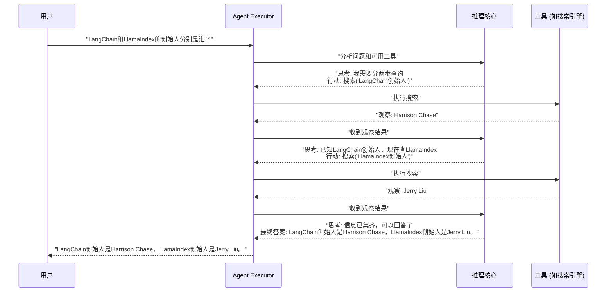
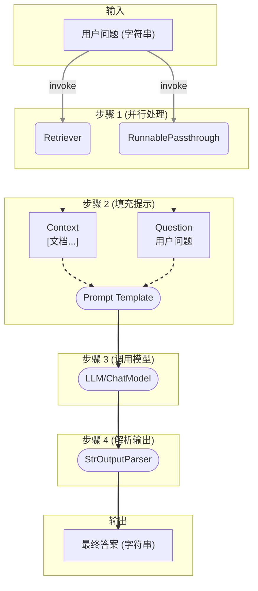

**LangChain 系列文章（三）**

在咱们这个系列的前两篇文章里，我们已经把 LangChain 的基本架构和核心组件（模型、提示、记忆等）都摸了个遍。现在，终于到了最激动人心的部分：**编排与执行**。

LangChain 究竟是怎么把那些独立的“零件”串起来，变成一条能搞定复杂任务的智能流水线的？答案就藏在 Chains、Agents，以及它们背后的灵魂——LCEL（LangChain Expression Language）之中。

## **一、 Chains (链)：任务执行的“固定套餐”**

你可以把“链”（Chains）想象成一条预先设定好的流水线，或者一份“固定套餐”。它把模型、提示、记忆这些组件按照固定的顺序打包好，一个组件的产出，自动流转成下一个组件的“食材”。


### **为啥需要链？—— 告别杂乱无章**

直接用代码调用 LLM 当然也能跑，但很快你就会发现两个头疼的问题：

1. **代码乱糟糟**：东一榔头西一棒子的命令式代码，逻辑散得到处都是，过几天自己都看不懂了。链提供了一个清爽的、声明式的结构，把整个工作流封装成一个对象，一目了然。
2. **不停造轮子**：很多逻辑，比如“格式化提示 -> 调用模型 -> 解析输出”，会在不同地方反复出现。链把这些常用模式打包好，让你像调用函数一样方便地复用。

说白了，链的核心就是 **结构化** 与 **可复用**。它通过强制规定输入（`input_keys`）和输出（`output_keys`），确保了不同的链之间可以像乐高积木一样，稳稳当当地拼接在一起。

### **LLMChain：最基础的那条链**

`LLMChain` 是所有链里最基础、最常见的一款。它封装了和 LLM 打交道的最简流程：**接收输入 -> 格式化提示 -> 调用模型 -> 返回结果**。

#### **代码实战：来，整一个！**

```python
from langchain_openai import ChatOpenAI
from langchain.prompts import ChatPromptTemplate
from langchain.chains import LLMChain

# 1. 找个靠谱的模型
llm = ChatOpenAI(model="gpt-4o")

# 2. 写个提示模板，告诉它要干啥
# 注意 {product} 这个占位符，它就是我们的输入变量
prompt = ChatPromptTemplate.from_template(
    "你是个起名大师，给一家卖 {product} 的公司想个酷炫的名字。"
)

# 3. 把模型和提示组装成链
# LLMChain 会自动从 prompt 里找到 'product' 作为输入
# 它的输出，默认就叫 'text'
chain = LLMChain(llm=llm, prompt=prompt)

# 4. 跑起来！
# 输入必须是个字典，key 得是 'product'
result = chain.invoke({"product": "高品质手工巧克力"})
print(result)
# -> {'product': '高品质手工巧克力', 'text': '可以试试 "ChocoCraft"、"The Cocoa Alchemist" 或者 "Velvet Bloom Chocolates"。'}
```

### **不止于此：五花八门的“链”**

当然，LangChain 的世界里远不止 `LLMChain` 这一种。

* #### **Sequential Chains (顺序链): 任务接力棒**

    有时候，一个任务需要好几步才能完成，而且上一步的结果正好是下一步的输入。这时候，“顺序链”就闪亮登场了。它就像一个接力赛，自动把前一棒的结果递给下一棒。

    ```mermaid
    graph TD
        A["输入'高端定制家具'"] --> B["Chain 1 (起名)"]
        B -- "输出 'Artisan Haven'" --> C["Chain 2 (写广告语)"]
        C -- "输出 'Artisan Haven...'" --> D["最终广告语"]

        subgraph "SequentialChain 内部"
            direction LR
            B -- "自动传递输出" --> C
        end

        style A fill:#f9f,stroke:#333,stroke-width:2px
        style D fill:#ccf,stroke:#333,stroke-width:2px
    ```

    *图1: SimpleSequentialChain 执行流程示意图*

    **代码实战：创建一个顺序链**

    ```python
    from langchain.chains import SimpleSequentialChain

    # 第一个链：给产品起名
    prompt_name = ChatPromptTemplate.from_template("为生产 {product} 的公司想个创意名字。")
    chain_one = LLMChain(llm=llm, prompt=prompt_name)

    # 第二个链：根据公司名写广告语
    prompt_slogan = ChatPromptTemplate.from_template("为公司 '{company_name}' 写一句吸引人的广告语。")
    chain_two = LLMChain(llm=llm, prompt=prompt_slogan)

    # SimpleSequentialChain 会自动把 chain_one 的输出（即使key是'text'）
    # 作为输入（变量名为'company_name'）传给 chain_two
    overall_chain = SimpleSequentialChain(chains=[chain_one, chain_two], verbose=True)

    result = overall_chain.invoke("高端定制家具")
    print(result)
    # ->
    # > Entering new SimpleSequentialChain chain...
    # > ... (chain_one 的原始输出)
    # > ... (chain_two 的原始输出)
    # > Finished chain.
    # -> {'input': '高端定制家具', 'output': '“Artisan’s Touch: Your Vision, Our Craft.”'}
    ```

* **RetrievalQA Chain**: 这可是构建 RAG（检索增强生成）应用的核心武器。它内部整合了检索器（Retriever），能先根据你的问题去知识库里“找资料”，然后把找到的资料和你的问题一起打包发给 LLM，让它基于这些信息来回答。

* **Router Chains (路由链)**: 这家伙给应用装上了“大脑”。它能先用一个 LLM 判断你的意图，然后像个交通警察一样，把你“导流”到最合适的子链去处理。比如，你问天气，它就去找天气查询链；你问历史，它就去找知识问答链。

## **二、 Agents (代理)：让 LLM 自己做决定**

如果说“链”是按图索骥的乖孩子，那“代理”（Agents）就是被赋予了自主决策权的特工。它不再死板地遵循预设路径，而是 **把 LLM 当作推理引擎，动态地决定下一步该干啥**。


### **核心三件套：“思考-行动”循环**

一个代理系统，离不开这三样东西：

1. **Tools (工具)**: 这可不是普通的函数，每个工具都必须有一个精心编写的 **“说明书”（description）**，告诉 LLM 这个工具是干嘛的、怎么用。
2. **LLM (推理核心)**: 代理的大脑，负责思考和决策。
3. **Agent Executor (执行器)**: 驱动代理跑起来的核心循环，负责调度 LLM 和工具。

### **揭秘 ReAct 框架：LLM 是如何“思考”的？**

代理的“智能”并非魔法，其背后是像 ReAct 这样的框架在支撑。它的本质，是一个被执行器（Agent Executor）精密管理的 **“提示-生成-解析”循环**。

1. **精心构建提示**: 执行器会给 LLM 一个特殊的提示，里面包含了：我是谁（一个代理）、我能干啥（工具列表和说明书）、我之前干了啥（思考-行动-观察的历史记录），以及现在要解决啥问题。
2. **LLM 生成“想法”**: LLM 根据这个提示，生成一段文本，表明它的“思考过程”和下一步的“行动计划”。
3. **解析并执行**: 执行器拿到 LLM 的输出后，会用解析器（Output Parser）来解读。如果 LLM 说“我要用搜索工具查一下‘LangChain创始人’”，执行器就真的去调用搜索工具。
4. **循环往复**: 工具执行完的结果，会作为新的“观察”被添加回历史记录，然后开始新一轮的循环。直到 LLM 认为信息足够了，给出了“最终答案”，循环才会结束。

简单说，就是通过一个结构化的“对话模板”，逼着 LLM 把它的思考过程和行动计划说出来，然后程序再根据这些“指令”去干活。



*图2: Agent 的“思考-行动-观察”循环 (ReAct 框架)*

### **代码实战：构建一个会“上网冲浪”的 Agent**

光说不练假把式，咱们这就动手搞一个能用 Tavily 搜索引擎来回答实时问题的 Agent。

在最新版的 LangChain 中，创建一个 Agent 通常遵循以下步骤：

1. **定义工具 (Tools)**：准备好 Agent 能使用的武器。
2. **创建提示 (Prompt)**：从 Hub 拉取一个标准模板，告诉 Agent 如何思考和使用工具。
3. **创建 Agent**：使用 `create_react_agent` 这样的工厂函数，把模型、工具和提示“粘”在一起。
4. **创建执行器 (AgentExecutor)**：这是驱动 Agent 跑起来的引擎。

```python
# 首先，确保你已经安装了 tavily-python
# pip install -U tavily-python

from langchain_openai import ChatOpenAI
from langchain_community.tools.tavily_search import TavilySearchResults
from langchain import hub
from langchain.agents import create_react_agent, AgentExecutor

# 1. 准备好模型和工具
# 确保你已经设置了 OPENAI_API_KEY 和 TAVILY_API_KEY 环境变量
llm = ChatOpenAI(model="gpt-4o")
tools = [TavilySearchResults(max_results=1)]

# 2. 从 LangChain Hub 拉取一个预设的 ReAct 提示模板
# 这个模板专门用于指导 Agent 如何进行“思考-行动-观察”循环
prompt = hub.pull("hwchase17/react")

# 3. 创建 Agent
# 这个函数将模型、工具和提示绑定在一起，定义了 Agent 的核心逻辑
agent = create_react_agent(llm, tools, prompt)

# 4. 创建 Agent 执行器
# verbose=True 可以让我们清楚地看到 Agent 的每一步思考过程
agent_executor = AgentExecutor(agent=agent, tools=tools, verbose=True)

# 5. 跑起来！
question = "现在是2025年6月，请问 LangChain 的最新稳定版本是多少？它的主要作者是谁？"
result = agent_executor.invoke({"input": question})

print("\n最终答案：")
print(result["output"])
```

当你运行上面的代码时，`verbose=True` 会让你在控制台看到类似这样的输出：

```text
> Entering new AgentExecutor chain...

Thought: The user is asking two questions: the latest stable version of LangChain in June 2025 and who its main author is. I need to search for this information. I will start by searching for "LangChain latest stable version".
Action: tavily_search_results_json
Action Input: {"query": "LangChain latest stable version June 2025"}
Observation: [...] (Tavily返回的搜索结果)
Thought: I have found the latest version. Now I need to find the main author. I will search for "LangChain main author".
Action: tavily_search_results_json
Action Input: {"query": "LangChain main author"}
Observation: [...] (Tavily返回的搜索结果，其中提到 Harrison Chase)
Thought: I have all the information needed to answer the user's question.
Final Answer: LangChain的最新稳定版本是 [版本号]，它的主要作者是 Harrison Chase。

> Finished chain.
```

看到了吗？Agent 像一个真正的人类研究员一样，自己分析问题、拆解任务、使用工具、整合信息，最后得出答案。这就是 Agent 的魅力所在！

### **代理的真正价值：从“死板”到“灵活”**

链和代理最根本的区别就在于 **控制流**：

* **链的控制流是确定的**，开发者在代码里写死了“第一步干啥，第二步干啥”。
* **代理的控制流是不确定的**，由 LLM 在运行时根据情况“临场发挥”。

## **三、 LCEL：用“管道”优雅地粘合一切**

终于，我们来到了 LangChain 的灵魂——LCEL（LangChain Expression Language）。如果说 Chains 和 Agents 是各种功能的积木，那 LCEL 就是能把这些积木以最优雅、最灵活的方式拼装起来的“万能胶水”。

它引入了我们非常熟悉的管道符 `|`，让你能像搭乐高一样，把不同的组件串联起来，用代码清晰地描绘出一个 **计算图（Computation Graph）**。


### **背后功臣：Runnable 协议**

LCEL 的魔力源于一个叫做 `Runnable` 的协议。任何实现了这个协议的对象（模型、提示、解析器、检索器，甚至是你自己写的函数），都能用 `|` 无缝连接。

当你写下 `prompt | model | parser` 时，LCEL 并不会马上执行。它会创建一个叫 `RunnableSequence` 的新对象，把 `[prompt, model, parser]` 这个列表存起来。

只有当你调用这个新对象的 `invoke` 方法时，它才会像多米诺骨牌一样，依次调用列表中每个组件的 `invoke` 方法，并把前一个的结果传给后一个。更妙的是，当你调用 `stream` 方法时，LCEL 会智能地检查链条上的每个组件，就算有的组件本身不支持流式输出，LCEL 也能确保整个链条对外表现出流式的效果。

### **代码实战：用 LCEL 解构一个 RAG 链**

让我们看看用 LCEL 构建一个 RAG 应用是多么的行云流水：

```python
from langchain_core.runnables import RunnablePassthrough
from langchain_core.output_parsers import StrOutputParser
# 假设 prompt, model, retriever 已经被正确定义

# 一个用 LCEL 定义的完整 RAG 链
rag_chain = (
    # 步骤1: 并行处理，准备材料
    # 这里的字典语法创建了一个 RunnableParallel。
    # 它会同时做两件事：
    # 1. 用 retriever 去检索上下文，结果放进 "context"
    # 2. 用 RunnablePassthrough 把原始问题原封不动地放进 "question"
    # 输出是一个字典: {"context": [Docs...], "question": "原始问题"}
    {"context": retriever, "question": RunnablePassthrough()}

    # 步骤2: 用准备好的材料，填充提示模板
    | prompt

    # 步骤3: 把格式化好的提示扔给模型
    | model

    # 步骤4: 把模型的输出（一个AI Message对象）解析成干净的字符串
    | StrOutputParser()
)

# 跑起来！
response = rag_chain.invoke("What is Task Decomposition?")
print(response)
```

这个 RAG 链的数据流是这样的：



*图3: RAG 链的 LCEL 数据流图*

看到了吗？使用 LCEL，你不再是简单地“调用”组件，而是在“组合”它们，构建出逻辑清晰、一目了然的数据流。更重要的是，这种声明式的方式，让你自动获得了流式处理、异步执行、并行计算等高级特性，使你能够专注于“做什么”，而不是“怎么做”。

---

至此，我们已经把 LangChain 的核心组件和编排艺术都探索了一遍。**在下一篇，也是本系列的收官之作《【生态篇】LangSmith, LangServe, LangGraph 三剑客》中，我们将把视野扩展到 LangChain 的外围生态，看看这些强大的工具是如何帮助我们开发、部署和维护生产级别的 LLM 应用的。敬请期待！**
