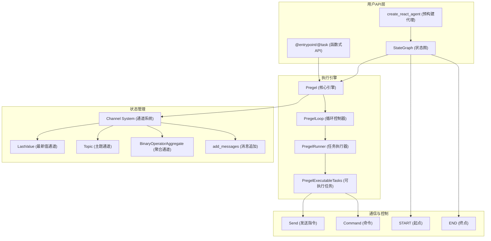
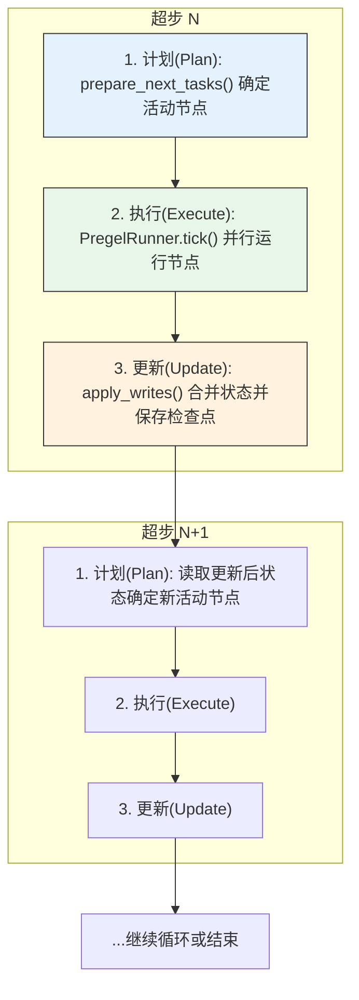
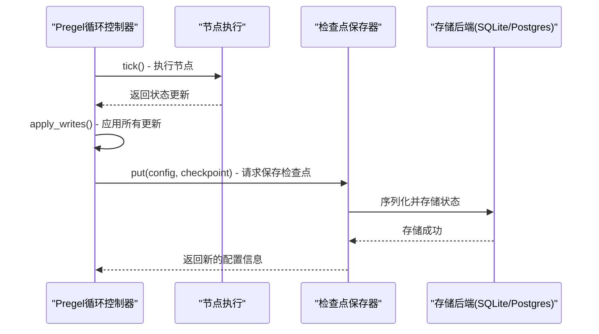
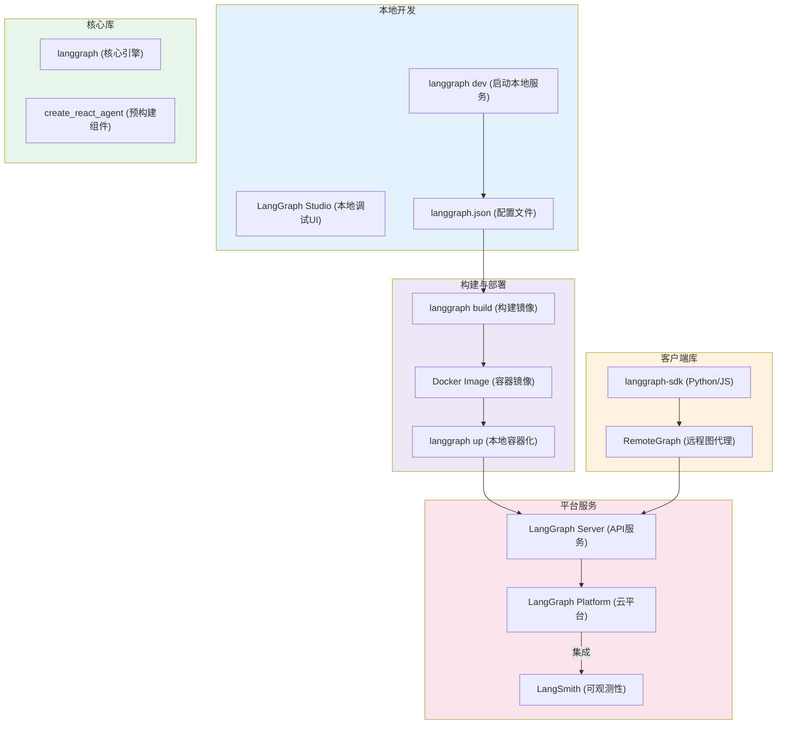

用过 LangChain 的朋友，想必都对它那套丝滑的顺序链（Chains）不陌生。但随着我们想构建更聪明的 AI 代理（Agent）——那种会思考、能修正、甚至会“反悔”的智能体——你可能会发现，LangChain 固有的 DAG（有向无环图）结构有点力不从心了。

标准的链式结构就像一条单行道，数据只能勇往直前，这对于简单的“检索-生成”任务来说足够了。可一旦遇上需要判断、循环、甚至走回头路的复杂场景，DAG 就显得捉襟见肘。为了解决这个痛点，LangChain 团队带来了 **LangGraph**，一个专为构建有状态、可循环的复杂 AI 应用而生的新框架。

这篇文章，我们就来一次深度的架构之旅，从核心概念到执行引擎，彻底搞懂 LangGraph 是如何为我们构建高级 AI 应用提供动力的。

## 一、为什么需要图：超越线性链的局限

举个例子，一个智能客服代理。它得理解问题、信息不足时要追问、需要查数据库就调用工具、调用失败了还得换个工具重试。整个过程充满了判断、循环和自我修正，而这些恰恰是标准 DAG 难以优雅表达的。

这些行为，本质上是**循环的**。LangGraph 的核心价值，就是将这种非线性流程，用一个更灵活的**图（Graph）**来建模，允许我们创建包含循环的路径，让 AI 代理真正拥有“思考”和“决策”的能力。



*图: LangGraph 核心架构一览*

## 二、核心架构：状态机驱动的图计算

LangGraph 的设计哲学可以浓缩成一个词：**状态机（State Machine）**。

你可以把整个图的运行过程想象成一场复杂的棋局。棋盘的当前布局，就是中心化的**状态（State）**；棋手（或棋子）的每一次行动，就是一个**节点（Node）**；而决定下一步该由谁、如何行动的规则，就是连接节点的**边（Edge）**。整个应用，就是这个状态在节点和边的作用下，不断演进、直至终局的过程。

### 1. State (状态)：图的唯一真相之源

状态是整个图的“中央记忆库”，所有节点都从这里读取信息，并把结果写回这里。在代码里，我们通常用 `TypedDict` 或 Pydantic 的 `BaseModel` 来定义它。

它的一个精妙设计是，通过 Python 的 `Annotated` 类型注解，我们可以直接在状态类里声明每个字段的**更新逻辑**，也就是定义一个“归约函数”（Reducer）。

```python
import operator
from typing import TypedDict, Annotated, Sequence
from langchain_core.messages import BaseMessage

# 定义一个状态类
class AgentState(TypedDict):
    # messages 字段的更新方式是追加 (operator.add)
    # 每次有新消息，就拼接到现有列表后面
    messages: Annotated[Sequence[BaseMessage], operator.add]

    # other_field 字段没有注解，默认更新方式是覆盖
    # 新值会直接替换旧值
    other_field: str
```

当一个节点执行完，返回一个包含 `messages` 键的字典时，LangGraph 会检查 `AgentState` 的注解，看到 `operator.add` 后，它就不会用新值覆盖旧值，而是聪明地将新消息**追加**到现有列表末尾。而没有注解的 `other_field` 则会沿用默认行为，直接**覆盖**旧值。

这个机制在 LangGraph 内部被称为**通道（Channels）**。你可以理解为，每个状态字段都绑定了一个通道，注解则定义了这个通道如何处理新旧数据。常见的通道类型包括：

* `LastValue`: 默认行为，只保留最后一个写入的值。
* `BinaryOperatorAggregate`: 使用指定的二元操作符（如 `operator.add`）来合并新旧值。
* `Topic`: 允许多个节点向同一个通道写入，并将所有值收集成一个列表，适合需要“广播-收集”的场景。

这种声明式的状态管理，让复杂的更新逻辑变得非常清晰和可预测。

### 2. Nodes (节点)：原子化的工作单元

节点是图中的基本工作单元，负责执行具体的计算任务。它可以是一个简单的 Python 函数，也可以是一个封装了复杂逻辑的 LangChain Runnable。

所有节点都遵循一个简单的约定：接收当前的 `state` 对象作为输入，执行任务，然后返回一个字典来**请求**更新状态。这个返回字典里的键必须在 `AgentState` 中有过定义，这保证了所有状态修改都是类型安全且可追-溯的。

### 3. Edges (边)：指挥交通的动态规则

边（Edge）决定了节点之间的流转方向，是实现复杂逻辑的关键。

* **静态边 (`add_edge`)**: 最简单的形式，定义了固定的 `A -> B` 路径。`start_node` 执行完后，流程无条件地流向 `end_node`。
* **条件边 (`add_conditional_edges`)**: 这是 LangGraph 强大之处。当 `start_node` 执行后，一个你指定的**决策函数**会被调用。该函数接收最新的 `state`，并根据其内容返回一个字符串（比如 `"continue"` 或 `"end"`），这个字符串会决定流程接下来该走向哪个节点。

这种设计巧妙地将**执行逻辑（节点做什么）**与**控制流逻辑（下一步去哪）**分离开来，使得整个图的结构既灵活又清晰。

## 三、执行引擎：Pregel 模型的实现

LangGraph 的执行引擎，其核心思想源自 Google 的一篇著名论文——Pregel。这个引擎采用的是**批量同步并行（Bulk Synchronous Parallel, BSP）**模型。

听起来可能有点复杂，但我们可以把它理解成一个高度协调的“回合制”系统。Pregel 将图的执行过程分解为一系列的“**超步**”（Supersteps）。在每个“超步”中，引擎只做三件事：

1. **计划 (Plan)**: 引擎首先审视全局状态，根据边的逻辑，确定当前“回合”有哪些节点需要被执行。这个过程由 `prepare_next_tasks()` 完成。
2. **执行 (Execute)**: `PregelRunner` 会接管所有待执行的节点，并将它们**并行执行**。这意味着，如果多个工具或 LLM 调用互不依赖，它们就能同时开跑，大大提升了效率。
3. **更新 (Update)**: 等待当前回合所有节点都执行完毕，引擎会收集它们的全部输出，通过 `apply_writes()` 函数，将这些结果**一次性地、原子地**合并到中心状态里。这个阶段也是保存检查点（Checkpoint）的理想时机。

这个“计划-执行-更新”的循环会不断重复，推动状态演进，直到流程抵达一个特殊的 `END` 节点，宣告任务完成。



*图1: Pregel 的“超步”执行模型*

这种模型的优势很明显：

* **天生并行**: 在同一个“超步”里，互不依赖的节点可以被高效地并行处理。
* **持久化与容错**: 每个“超步”更新阶段结束后，都是一个绝佳的**检查点（Checkpoint）**时机。我们可以把当前完整状态存盘，万一程序崩溃，也能从上一个检查点恢复，保证状态不丢失。
* **人类在环（Human-in-the-Loop）**: 同样，我们可以在两个“超步”之间暂停，等待外部指令，这为需要人工审核或干预的流程提供了可能。

## 四、持久化与容错：检查点机制

一个真正健壮的 Agent，不能像金鱼一样只有七秒记忆。它需要能够经受住意外崩溃、服务重启，甚至需要暂停下来等待几天后的人工指令。LangGraph 通过其强大的**检查点（Checkpointing）**系统，完美地解决了这个问题。

这个系统的核心是 `BaseCheckpointSaver` 接口，它定义了状态持久化的标准操作。LangGraph 官方提供了多种即插即用的实现：

* `InMemorySaver`: 用于快速原型验证和测试，将所有状态保存在内存中，程序一停，数据就没。
* `SqliteSaver`: 轻量级的单文件数据库，适合单机部署的应用。
* `PostgresSaver`: 生产级的解决方案，使用强大的 PostgreSQL 数据库，支持高并发和分布式部署。

### 工作原理

当你为一个图配置了 `checkpointer` 后，神奇的事情发生了：

在每个“超步”的**更新（Update）**阶段结束后，LangGraph 会自动调用 `checkpointer.put()` 方法，将当前图的**完整状态快照**（包括所有通道的值、版本信息、待执行任务等）序列化后存入你选择的后端（如 SQLite 或 PostgreSQL）。



*图: 检查点保存流程*

这个机制带来了几个核心优势：

1. **时间旅行**：你可以随时通过 `get_state_history()` 拉取一个会话的所有历史状态，轻松实现“回滚”到任意一步，或从某个历史节点“分叉”出一条新的执行路径。
2. **故障恢复**：如果程序在执行中途意外退出，下次重启时，只需提供相同的会话 ID (`thread_id`)，LangGraph 就能自动从最后一个成功的检查点加载状态，无缝衔接。
3. **长时任务**：对于需要人工审批等长时间等待的流程，图可以被安全地中断。几天后，当人工操作完成，可以通过 `update_state()` 注入新信息，然后让图从中断处继续运行。

## 五、高级控制流：中断与动态路由

除了被动地从故障中恢复，LangGraph 还提供了主动控制工作流的能力，让人机交互的实现变得非常直接。

### 1. 中断与恢复 (`interrupt()`)

这是实现“人类在环”最直接的方式。你可以在图的任意节点执行前设置一个**中断点**。

```python
from langgraph.graph import StateGraph

# ... 定义 state 和 nodes ...

builder = StateGraph(AgentState)
# ... 添加节点 ...

# 在执行 'tool_node' 之前，暂停执行
builder.add_conditional_edges(
    "agent",
    should_continue,
    {
        "continue": "tool_node",
        "end": END
    }
)
# 编译时，指定中断点
graph = builder.compile(
    checkpointer=checkpointer,
    interrupt_before=["tool_node"] # 在 tool_node 执行前中断
)
```

当流程走到 `tool_node` 之前，执行会自动暂停，并保存当前状态。这时，你可以：

1. **检查状态**：通过 `graph.get_state(config)` 查看 Agent 的决策，比如它打算调用哪个工具、参数是什么。
2. **人工干预**：如果发现工具有问题，可以通过 `graph.update_state(config, ...)` 直接修改状态，比如修正工具参数，甚至强制跳到另一个节点。
3. **恢复执行**：调用 `graph.invoke(None, config)`，让图从中断处继续跑起来。

### 2. 命令系统 (`Command`)

如果说 `interrupt()` 是一个“暂停按钮”，那 `Command` 就是一个功能更强大的“遥控器”。一个节点可以不返回状态更新，而是返回一个 `Command` 对象，来直接操纵图的执行流。

```python
from langgraph.graph.message import AnyMessage, SystemMessage
from langgraph.pregel.io import Send

def dynamic_router(state: State) -> list[Send]:
    # 根据状态决定下一步该做什么
    if some_condition(state):
        # 直接将任务发送给 'human_approval' 节点
        return [Send("human_approval", {"messages": [SystemMessage("需要人工批准")]})]
    else:
        # 发送给另一个节点
        return [Send("auto_process", state)]
```

`Send` 是 `Command` 的一种，它允许一个节点**动态地、一次性地**将任务派发给图中的任何其他节点，甚至可以创建全新的、原本不存在的执行分支。这为实现高度动态和自适应的多智能体协作提供了极大的灵活性。

## 六、开发与部署生态

LangGraph 的目标不止于一个强大的库，它还致力于提供从本地开发、调试到云端部署的完整“全家桶”服务。这套生态系统旨在让开发者能专注于业务逻辑，而将繁杂的工程问题交给平台。



*图: LangGraph 生态系统*

整个工作流非常清晰：

1. **本地开发 (`langgraph dev`)**: 在本地用 `langgraph` 库写好图的逻辑，通过 `langgraph.json` 定义好依赖和入口。一条 `langgraph dev` 命令就能启动一个带热重载的本地服务器，并自动打开 **LangGraph Studio** 调试界面。你可以在这个 UI 上可视化执行流程、查看每一步的状态变化，调试体验很棒。

2. **构建 (`langgraph build`)**: 本地调试满意后，`langgraph build` 会读取配置，自动生成 `Dockerfile`，并将应用打包成一个标准的 Docker 镜像。

3. **部署 (`langgraph up` / 云平台)**:
    * **本地容器化**: `langgraph up` 会用 `docker-compose` 在本地拉起一整套服务（应用、数据库、缓存），模拟准生产环境。
    * **云端部署**: 你也可以将镜像推送到 **LangGraph Platform**。平台会接管托管、扩缩容、日志、监控等工作，并与 **LangSmith** 深度集成，提供生产级的可观测性。

4. **客户端交互**: 无论图部署在哪里，你都可以通过 `langgraph-sdk` (Python/JS) 与之交互，触发运行、管理会话、流式获取结果，就像调用一个普通的 API。

这套流程覆盖了从想法到生产服务的完整生命周期，大大降低了 AI 应用的工程化门槛。

## 七、代码实战：构建具备长时记忆的聊天机器人

理论说了这么多，不如直接上代码。下面这个例子将展示 LangGraph 如何解决一个非常实际的问题：在多轮对话中，如何防止对话历史过长导致 Token 溢出？答案是：在对话进行中，动态地对历史消息进行**自省和总结**。

我们将使用 `langmem` 这个库，它为 LangGraph 提供了开箱即用的记忆管理节点。

```python
from typing import Any, TypedDict

from langchain_openai import ChatOpenAI
from langchain_core.messages import AnyMessage, SystemMessage
# 这是一个近似计算 token 的工具，比精确计算快
from langchain_core.messages.utils import count_tokens_approximately
from langgraph.graph import StateGraph, START, MessagesState
from langgraph.checkpoint.memory import InMemorySaver
# 需要安装 langmem: pip install langmem
from langmem.short_term import SummarizationNode

# 1. 初始化模型
# 一个用于主要对话，一个专门用于总结，可以不同，这里为了简单使用同一个
model = ChatOpenAI(model="gpt-4o")
summarization_model = model.bind(max_tokens=128) # 限制总结模型的输出长度

# 2. 定义状态
# 继承自 MessagesState，它内置了 `messages` 字段和对应的追加更新逻辑
# 我们额外增加一个 context 字段，用于在节点间传递非消息类的上下文信息
class State(MessagesState):
    context: dict[str, Any]

# 这是一个中间状态，用于将总结后的消息传递给主模型
# 这样做可以使节点间的依赖关系更清晰
class LLMInputState(TypedDict):
    summarized_messages: list[AnyMessage]
    context: dict[str, Any]

# 3. 配置核心节点：SummarizationNode
# 这个节点是 langmem 库提供的，专门用于处理消息总结
summarization_node = SummarizationNode(
    token_counter=count_tokens_approximately,
    model=summarization_model,
    max_tokens=512,  # 允许进入 LLM 的总 token 数上限
    max_tokens_before_summary=256, # 对话历史超过多少 token 时，触发总结机制
    max_summary_tokens=256, # 总结本身的最大 token 数
)

# 4. 定义主对话节点
def call_model(state: LLMInputState):
    # 注意这里的输入是 summarized_messages，而不是完整的 state['messages']
    response = model.invoke(state["summarized_messages"])
    # 节点的返回值必须是一个字典，键对应状态类中的字段
    return {"messages": [response]}

# 5. 构建图
checkpointer = InMemorySaver()
builder = StateGraph(State)

# 添加两个节点：一个负责总结，一个负责生成回复
builder.add_node("summarize", summarization_node)
builder.add_node("call_model", call_model)

# 定义流程：从 START 开始，总是先经过 summarize 节点，再到 call_model 节点
builder.add_edge(START, "summarize")
builder.add_edge("summarize", "call_model")

graph = builder.compile(checkpointer=checkpointer)

# 6. 运行与测试
config = {"configurable": {"thread_id": "user123"}}
# 模拟多轮对话
graph.invoke({"messages": [("user", "你好，我叫鲍勃")]}, config)
graph.invoke({"messages": [("user", "你喜欢猫吗？写一首关于猫的短诗")]}, config)
graph.invoke({"messages": [("user", "那关于狗呢？")]}, config)

# 在多轮对话后，测试它是否还记得我的名字
final_response = graph.invoke({"messages": [("user", "还记得我叫什么吗？")]}, config)

# 打印最后一条消息和生成的总结
final_response["messages"][-1].pretty_print()
print("\n--- Conversation Summary ---")
# 总结内容被保存在了 context 字段中
print(final_response["context"]["running_summary"].summary)
```

### 执行流程深度剖析

这个例子清晰地展示了 LangGraph 如何通过状态和专职节点来解决复杂问题：

1. **状态设计 (`State`)**: 我们扩展了基础的 `MessagesState`，加入 `context` 字典。这个字典由 `SummarizationNode` 内部使用，用来跟踪和存储生成的对话摘要 (`running_summary`)，避免重复总结，就像 Agent 的“工作草稿本”。

2. **专职节点 (`SummarizationNode`)**: 这是流程的核心。每次调用主模型前，流程都会先经过它。它会检查当前 `state['messages']` 的 Token 总量：
    * **未超阈值**: 直接将原始消息列表传递给下一节点。
    * **超过阈值**: 调用 `summarization_model`，将最旧的几条消息压缩成摘要（例如“用户介绍了自己叫鲍勃，并询问了关于猫狗的诗歌”），然后用这个摘要**替换**掉原来的旧消息，形成一个更短的新消息列表。

3. **数据流**: 用户的输入先进入 `State['messages']`，经过 `summarize` 节点处理（可能被总结），然后 `call_model` 节点获取总结后的消息列表并生成回复，最后回复再次被添加回 `State['messages']`，完成一次循环。

通过这种方式，我们构建了一个既能保持长期记忆（通过总结），又能避免 Token 溢出的智能聊天机器人，这在标准 LangChain 中是很难如此优雅地实现的。

## 八、一种新的 Agent 构建范式

LangGraph 通过引入**状态机**和 **Pregel 执行模型**，从根本上解决了标准链在处理循环和复杂控制流上的短板。它将原本可能混乱的代理逻辑，规范成了一套清晰、可控、可持久化的图结构。

这不仅是技术升级，更是一种**思维范式的转变**。我们不再把 Agent 看作一个线性的“信息处理器”，而是看作一个在复杂状态空间中探索和决策的“智能体”。

这种转变意义深远：

* **对于单个 Agent**: 我们可以构建出更鲁棒、更智能的应用，它们能处理错误、自我反思、并与人协作。
* **对于多智能体系统**: LangGraph 天生就适合多智能体协作。每个 Agent 都可以是一个独立的图，它们之间通过共享状态或消息通道通信，形成一个更大的协同网络。无论是实现“反思-行动”（ReAct）循环，还是构建更复杂的“思维树”（Tree-of-Thought）或多代理协作模式，LangGraph 都提供了坚实的基础。
