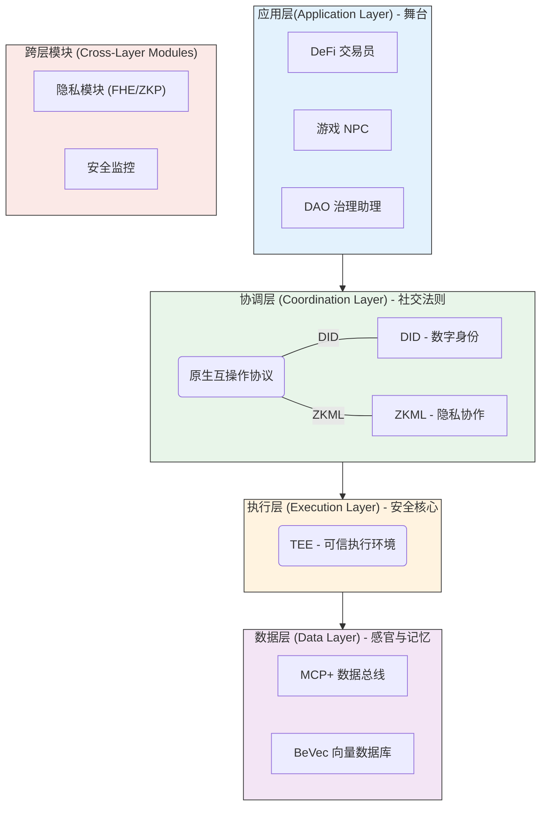
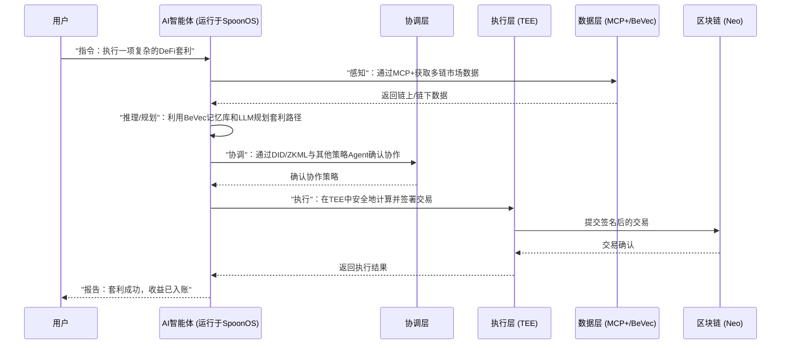

在Web3与AI叙事热潮当下，我们不再满足于讨论“AI能为Web3做什么”，而是开始见证一个全新物种的崛起——**AI智能体（AI Agent）**。它们是能在链上世界自主行动、拥有数字身份、管理自己资产的“数字原生公民”。然而，要让这些“公民”安全、可信、高效地生活和协作，就需要一个专门为它们设计的“城市”和“社会法则”。

这，就是SpoonOS被提出的时代背景。

当Neo的创始人达鸿飞不再仅仅谈论“智能经济”，而是将目光投向一个更宏大、更具生命力的“**感知经济（Sentient Economy）**”时，SpoonOS便作为这份宣言的载体应运而生。它并非又一个AI开发框架，而是Neo倾其生态之力，为即将到来的智能体时代，打造的一个原生操作系统。这不仅仅是一次技术迭代，更是一场关于未来数字文明形态的深刻构想。

## **SpoonOS究竟要解决什么问题？**

构建一个AI交易员，让它7x24小时为你分析市场、执行策略，听起来很酷。但当你真正着手去做，一系列棘手的、关乎生存根本的问题便会浮现：

1. 信任的难题：数字世界的“黑暗森林”
   我凭什么把我的私钥——掌管我全部数字资产的钥匙，托付给一个匿名的AI？在一个代码即法律、但代码也可能存在漏洞和后门的“黑暗森林”里，如何确保这个AI不会监守自盗，或者被黑客控制后反戈一击？现有的AI框架大多运行在中心化服务器上，这本身就与Web3的去中心化精神相悖，并引入了单点故障和审查风险。
2. 数据的孤岛：AI的“营养不良”
   AI的智能源于数据，就像生命离不开养分。一个顶级的AI交易员，不仅需要毫秒级的链上交易数据，还需要实时理解链下世界发生的一切：美联储的政策公告、社交媒体上的市场情绪、竞品项目的最新动态。这些数据分散在无数个API、数据库和区块链浏览器中，格式迥异，真伪难辨。如何让AI安全、高效、低成本地获取并理解这些跨越Web2和Web3的“营养”，是其能否成长的关键。
3. 隐私的悖论：在透明世界里保守秘密
   AI需要处理海量数据才能变得更聪明，但这些数据往往是用户的核心隐私，比如交易策略、持仓情况、个人偏好。在一个以透明和可追溯为特点的区块链世界里，如何让AI在利用这些敏感数据进行计算和决策时，不泄露任何秘密？这是一个近乎无解的悖论，也是制约AI在金融等高敏感领域应用的核心障碍。
4. 协作的屏障：从“独行侠”到“经济体”
   一个强大的智能体固然厉害，但真正的“感知经济”需要成千上万的智能体进行高效协作。当一个“分析师”AI想把它的市场洞察卖给一个“交易员”AI时，它们如何确定对方的身份是可信的？如何验证对方提供的信息或计算结果是真实有效的，而不是伪造的？如何进行原子化的、无需信任的价值交换？没有统一的身份、通信和验证标准，智能体之间将永远是“鸡同鸭讲”的“独行侠”，无法形成真正的经济网络。

这些问题，是任何想在Web3世界大展拳脚的AI项目都必须回答的。而SpoonOS，正试图从根基上给出它的答案。它要做的，不是简单地“连接”AI与区块链，而是要**创造一个让AI智能体能够可信、安全、自主地在链上生存和发展的原生环境**。

## **SpoonOS的架构：不止四层，是“创世”的蓝图**

为了解决上述难题，SpoonOS设计了一套精密的四层架构。但这不仅仅是技术的堆砌，更像是一幅构建未来数字文明的蓝图。

* **数据层 (Data Layer) - 智能体的“感官”与“记忆”**
  * **MCP+ (模型上下文协议增强版)**：你可以把它理解成智能体的“通用数据总线”。无论是链上的交易记录，还是Web2世界的新闻API，MCP+都能将其标准化，让智能体能够无差别地“感知”整个数字世界。它不仅仅是数据接入，更是一种数据语义的统一，确保AI能理解它所“看到”的一切。
  * **BeVec 向量数据库**：如果MCP+是感官，BeVec就是智能体的“海马体”——一个专为Web3设计的记忆系统。它不仅能存储信息，更能理解信息的“语义”，让智能体在需要时能迅速回忆起相关的知识和上下文，做出更精准的决策。其“Web3原生”特性可能意味着它能更好地处理与链上身份和资产相关联的数据，并支持数据来源的可追溯性。
* **执行层 (Execution Layer) - 智能体的“安全计算核心”**
  * 这里最核心的技术是**TEE（可信执行环境）**。简单来说，它就像是在CPU里开辟了一个“黑箱保险库”。任何代码和数据放进去运行，其机密性和完整性都由硬件保证，即使是操作系统本身也无法窥探。对于需要处理私钥、执行敏感策略的AI智能体来说，这层硬件级别的安全保障是建立信任的基石，从根本上解决了“我如何相信运行代码的节点”的问题。
* **协调层 (Coordination Layer) - 智能体的“社交法则”与“身份系统”**
  * **DID (去中心化身份)**：每个智能体都拥有一个自己的“数字护照”，可以被验证，但由自己掌控。这使得智能体在网络中的行为具有可归属性，是建立声誉和信任体系的前提。
  * **ZKML (零知识机器学习)**：这是最令人兴奋的部分之一。它允许一个智能体向另一个智能体证明：“我确实根据我们的约定，用我的模型处理了数据，并得出了这个结论”，但整个过程中**完全不需要展示我的原始数据和模型本身**。这为智能体之间无需信任的、保护隐私的协作，比如共享策略模型、交易信号验证等，打开了想象空间。
* **应用层 (Application Layer) - 开发者大展拳脚的“舞台”**
  * 在坚实的基础之上，开发者可以构建各种AI应用，无论是DeFi交易员、游戏NPC，还是去中心化科研助理。他们无需再为底层的信任、隐私和数据问题操心，可以更专注于应用逻辑本身的创新。

**值得一提的是SpoonOS对隐私和安全的“纵深防御”理念。** 它将**FHE（全同态加密）**、**ZKP（零知识证明）和TEE**这三大前沿技术结合在一起。这并非简单的技术叠加，而是分别针对“使用中的数据”（FHE）、“可验证的计算”（ZKP）和“执行中的代码”（TEE）提供了全方位的保护。这种系统性的安全设计，是SpoonOS区别于许多其他AI框架的核心特征之一，展现了其在构建严肃、高价值应用方面的决心。

### **一个智能体的一天：SpoonOS工作流程**

为了更直观地理解，让我们想象一个DeFi套利智能体在SpoonOS上的一天是如何度过的：

## **SpoonOS vs. ElizaOS：两种文明的演进路径**

如果说SpoonOS是在精心设计一座未来都市，那么像ElizaOS这样的主流框架，则更像是在为全世界的建筑师提供一套最好用的“乐高积木”。

| 特性维度     | SpoonOS：一个“原生文明”的缔造者                                                                                                  | ElizaOS：一个“普适工具”的赋能者                                                                                           |
| :----------- | :------------------------------------------------------------------------------------------------------------------------------- | :------------------------------------------------------------------------------------------------------------------------ |
| **核心哲学** | **自上而下，深度整合。** 旨在为AI智能体构建一个“原生”的、安全可信的生存环境。它认为，没有坚实的基础，上层建筑皆为海市蜃楼。      | **自下而上，灵活开放。** 旨在降低开发门槛，让更多开发者能快速构建个性化的AI代理。它相信，繁荣始于广泛的参与和快速的迭代。 |
| **技术路径** | **与区块链深度耦合 (Neo)。** 强调原生的隐私安全协议栈（FHE/ZKP/TEE）和数据组件。这种耦合性既是优势（性能、协同），也是一种锁定。 | **与区块链解耦。** 通过插件化的方式支持多链，采用开发者熟悉的TypeScript语言。这种灵活性使其能适应更广泛的生态。           |
| **优势体现** | **高安全、高可信。** 特别适合处理高价值、高风险任务的场景，如DeFi、数字身份等。其安全性是内生的，而非外挂的。                    | **高效率、高灵活性。** 生态系统更容易繁荣，能快速将AI能力集成到各种Web2和Web3应用中。开发者可以“即插即用”，快速验证想法。 |
| **当前挑战** | **生态建设周期长。** 依赖Neo生态的壮大，且对开发者的技术要求更高。需要吸引那些既懂AI又懂底层技术的“硬核”开发者。                 | **原生安全性的缺失。** 在处理高度敏感操作时，安全性更多依赖于插件和开发者自身的设计。这在金融等领域可能成为其天花板。     |

* **SpoonOS** 就像是苹果的**iOS生态**。它提供了一套从硬件（TEE）到操作系统（四层架构）再到应用商店（应用层）的完整、封闭但高度安全的解决方案。开发者在这个生态里开发的应用，天生就享有顶级的安全和隐私保护。它的目标用户是那些追求极致体验和安全性的消费者和开发者。
* **ElizaOS** 则更像是**Android + VS Code**的组合。它极度开放、灵活，拥有庞大的插件生态和开发者社区，你可以用它在任何设备上构建任何应用。它的成功依赖于社区的智慧和活力，开发者可以自由组合工具，但也需要自己对最终产品的安全和性能负责。

## **我们该期待SpoonOS什么？**

SpoonOS无疑是一场雄心勃勃的社会实验。它赌的不是短期内AI能为Web3带来多少新奇的应用，而是AI作为一种**新的经济主体**，将如何重塑整个去中心化世界的经济秩序。

对于开发者和Web3爱好者来说，SpoonOS的出现意味着：

1. **一个更高安全标准的选择**：当你需要构建处理真实资产、涉及核心隐私的AI智能体时，SpoonOS提供的原生安全框架将极具吸引力。它将安全从一个“需要考虑的特性”提升到了“与生俱来的属性”。
2. **一次范式的转变**：它促使我们思考，AI不再仅仅是“工具”，而是可以被赋予身份、资产和权利的“伙伴”。我们与AI的关系，将从“使用”演变为“协作”。
3. **一个长期的价值主张**：SpoonOS的成功，将不仅仅体现在其技术上，更将体现在其所催生的“感知经济”的繁荣程度上。它的价值捕获，可能来自于整个经济生态的增长，而非单一的应用。

当然，SpoonOS的道路注定漫长。其宏大的技术愿景需要时间来实现，更需要一个庞大而活跃的开发者生态来填充血肉。目前，其详细的SDK和技术文档仍有待完善。但这并不妨碍我们将其视为Web3 AI领域一次勇敢的、值得尊敬的探索。

最终，无论是SpoonOS的“原生文明”，还是ElizaOS的“插件宇宙”，它们都在用自己的方式，将我们带向一个由AI深度参与、更加智能、更加自动化的未来。而这场关于未来的伟大构建，才刚刚开始。
