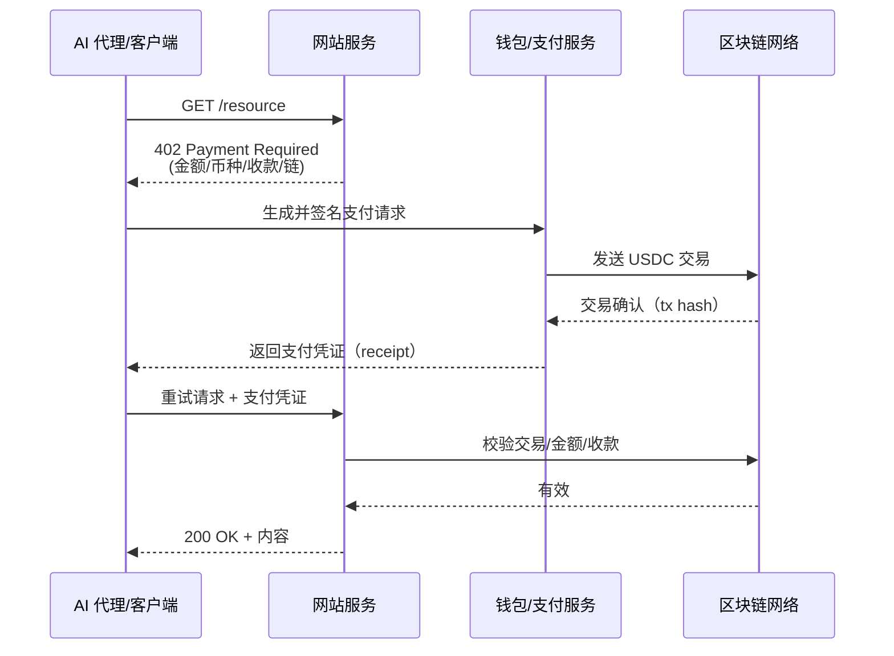
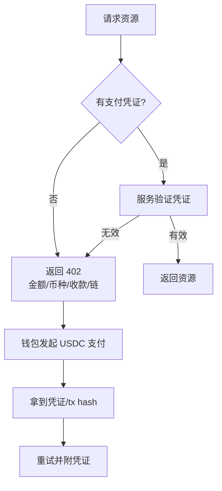
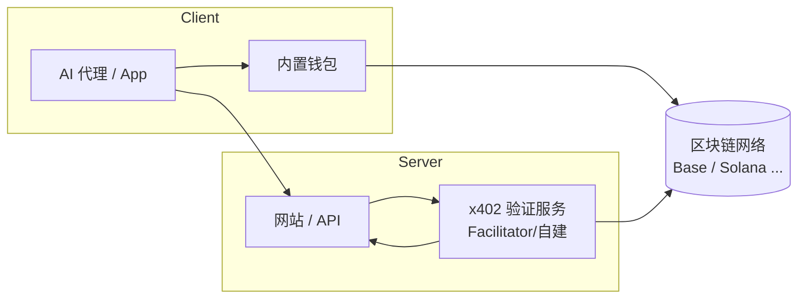

我把一个小任务交给 AI 代理，它撞上了 402。不是权限校验拦住了它，而是网站要求当场结算。在一次 HTTP 往返里，USDC 到账，页面放行，用时两秒。

那一刻我明白了：这不是在网页上多放一个支付按钮，而是把支付塞回了互联网的底层协议。

我的判断很直接：x402 给 AI 代理和网站搭了一条能跑小额价值的高速路。技术细节有门槛，叙事非常强，但生意的逻辑清清楚楚。

读完这篇，你会知道它怎么工作，哪些人在推进，Twitter 上那波 Meme 到底讲了什么故事，还有更现实的部分（如何用最小代价验证一个机会）。

## x402 为什么此时出现：团队、时间点、目标

x402 是一种面向互联网的开放支付协议，由 Coinbase 主导开发并于 2025 年 5 月发布，Cloudflare 等重量级公司共同参与。它旨在复活 HTTP 规范中沉睡近 30 年的 402 状态码（"Payment Required"），将**稳定币支付直接嵌入到 HTTP 网络请求**之中，作为 AI 代理和 Web 服务之间的原生支付标准。2025 年 9 月，Coinbase 携手 Cloudflare 成立了 x402 基金会推动该标准，并吸引了 AWS、Anthropic、Circle（USDC 发行方）、NEAR 等科技和加密公司加入生态。甚至全球支付巨头 Visa 也在 10 月中旬宣布支持 x402 标准--作为全球最大支付网络，Visa 此举被市场解读为主流 adoption 的强力信号。这一系列动作显示出 x402 背后的团队愿景：**打造一个互联网原生的即时支付轨道**，服务即将到来的"自治代理经济（Agentic Economy）"，让 AI 代理和应用能够像交换数据一样自由交换价值。

x402 协议的诞生源于对传统支付痛点的反思。当前网络缺乏内置的微支付能力：HTTP 402 自 1997 年定义以来一直未启用，因为传统互联网时代没有简便的付费手段。为小额内容付费，用户常被迫走向**广告模式**或笨重的订阅模式，支付流程充满摩擦。Coinbase 开发 x402 正是为了解决这一"未竟的支付梦"--随着区块链上**稳定币**的普及和 Layer2 降低交易费用至几分钱级别，终于具备了激活 402 的条件。x402 的目标是**让支付像网页请求一样简单**：打通 Web 与区块链，使得用户或 AI 无需注册账户、无需繁琐的身份验证，就能在数秒内完成自动结算。正如 Coinbase 工程负责人 Erik Reppel 所言："互联网一直需要一种原生的支付方式……就像 HTTPS 之于安全，x402 有望定义互联网的下一时代，让价值像信息一样自由流动"。这一愿景也得到各界响应，Cloudflare 看重其重构网络商业模式的潜力，Visa 则视其为抢占 AI 支付先机的战略布局。可以说，x402 承载着**在 AI 时代重塑网络支付基建**的宏大目标。

## 2 秒结算怎么做到：机制与 4337/ENS 的边界

**协议机制与架构：** x402 协议的运作流程可概括为"HTTP + 区块链支付"的五步握手。当客户端（用户或 AI 代理）请求一个需要付费的资源时：

- **402 响应触发支付：** 服务器发现请求未附支付凭证，则返回 HTTP 402 状态码，并在响应体 JSON 中给出付款要求（金额、币种、收款地址、指定区块链等）。这就像网站弹出一个"账单"，告知"需支付例如 0.01 USDC 到某地址才能继续"。
- **自动链上付款：** 客户端读取支付要求后，由内置钱包自动发起链上交易支付所需的稳定币（默认 USDC 等锚定币）。x402 设计为**链中立**，支持任意公链支付，当前常用 Coinbase 的 Base（二层网络）或 Solana 等高性能链以保证手续费低廉、确认快速。支付时客户端会生成一个加密签名的"支付凭证"（包含交易哈希等），证明"我已经付费"。值得一提的是，x402 支持**免 Gas 签署**等优化，即由专业服务商代付 Gas（如 Coinbase 提供的 Facilitator 服务），进一步降低使用门槛。
- **携带凭证重试请求：** 客户端在支付完成后，重新对原资源发起请求，并在 HTTP 头中附上先前生成的支付凭证（自定义头 X-PAYMENT）。服务器或其后台的 x402 验证服务（Facilitator）会检验该凭证有效性：查询链上交易是否到账、金额正确等。
- **资源交付与确认：** 一旦验证通过，服务器立即返回所请求的资源，同时在响应头 X-PAYMENT-RESPONSE 中附上支付结果确认信息（例如交易 ID 等）。整个过程至此完成，若验证失败则服务器仍返回 402 要求重新支付。

下面两张图，把握手与决策过程讲清楚。

这让网站与 AI 代理间能自动协商付款，无需人工注册或传统支付中介。

通过上述机制，x402 实现了真正的**嵌入式实时支付**：无需账户登录、无需输入信用卡或繁琐 OAuth 认证，价值传输像数据请求一样无缝。正如开发者所说，这是一种"**投币式网络**"体验：就像给互联网装上自动贩卖机的投币口，扔进数字货币即刻获取服务。整个支付流程通常在 2 秒内完成，协议本身**零额外手续费**（只需区块链基础 gas 费）。而 Coinbase 等提供的支付 Facilitator 可以选择性收取服务费或依赖底层链 Gas 获得收益，可持续运营生态。此外，x402 天然支持**微支付和按次计费**：可以轻松处理\$0.01 级别的交易成本，这对于传统支付网关高额手续费和 T+1 结算周期而言是革命性的突破。协议层面对安全也考虑周全--支付凭证采用非对称加密签名防伪造，服务器可借助可信 Facilitator 快速查账，无需自行跑完整节点。总的来说，x402 通过精巧地将 HTTP 请求流程与链上转账结合，提供了一套**标准化的机器支付接口**。这让未来无论是人还是 AI，只要拥有一个数字钱包，就能直接参与互联网经济活动。

**核心创新点：** 相较其他支付或身份协议，x402 的特色在于利用已有互联网基础设施实现支付功能的**即插即用**。与其说 x402 发明了新支付，不如说它**兑现了 HTTP 已有却未实现的功能**。正如分析所言，其核心创新是"重新激活沉睡 30 年的 HTTP 402 状态码"，通过区块链支付让这一标准真正发挥作用。这样的设计带来多重优势：一是**通用互操作**--x402 基于 HTTP 协议，任何支持 HTTP 的客户端/服务器稍加改造即可兼容，无需从零建立新传输通道。二是**链无关与稳定币优先**--不同于绑定某单一网络或代币，x402 可在以太坊 L2、Solana 等不同链上使用，但倾向使用价值稳定的 USDC/USDT 进行结算，避免波动。三是**针对 AI/机器优化**--全流程无需人工介入，机器能够自主完成授权签名和付款，这为 AI Agent 赋予了经济行动能力（Economic Autonomy）。总之，x402 让"一次 HTTP 请求 = 一次价值交换"成为可能，以极简的交互实现过去难以想象的高频微付场景。

**与 ERC-4337 和 ENS 的对比：** x402 定位为 Web 支付层的新标准，与以太坊的 ERC-4337（账户抽象）和 ENS（以太坊域名服务）有本质区别，但都属于 Web3 基础设施的创新探索。ERC-4337 是一项**链上账户机制**升级提案，它通过在不改变共识层的情况下实现合约钱包、支付中介（Bundler）等功能，旨在改善用户使用加密钱包的体验（例如社交恢复、多签、安全自定义等）。ERC-4337 关注**交易签名和账户权限**的抽象，提升的是用户在链上执行交易时的便捷性和扩展性。而 x402 关注**交易请求和支付流程**的抽象，提升的是互联网环境中发起交易支付的自动化与标准化。两者可以相辅相成：举例来说，ERC-4337 让钱包具备更灵活的自动签名能力（如 AI 代理钱包设定策略自动支付），这恰好可用于 x402 场景中，由智能钱包根据 402 请求自动完成链上支付授权。因此 x402 并未取代 ERC-4337，而是构建在其之上进一步拓展支付场景到链外的 Web 和 AI 领域。相比之下，**ENS**（Ethereum Name Service）解决的是**地址命名与可读性**问题，通过把 0x 开头的复杂钱包地址映射为人类可读的域名（如 alice.eth），降低了用户转账和访问去中心化资源的门槛。ENS 与 x402 一个侧重**身份/地址层**，一个侧重**支付交互层**，但理念上有相通之处：二者都借用了互联网现有体系（DNS 域名、HTTP 状态码）来连接区块链功能，实现 Web2 到 Web3 的平滑过渡。例如，在未来完全体的 x402 应用中，服务器给出的收款地址可以是 ENS 域名，这样用户看到 402 账单时会显示易读的名称而非生涩地址，提升体验。总体而言，ERC-4337、ENS 和 x402 各自侧重不同层面的创新：**ERC-4337**强化链上账户能力，**ENS**解决链上地址的人性化，**x402**打通链上支付与 Web 交互。它们共同丰富了区块链与互联网融合的技术版图，各有其功能定位又有潜在协同之处。

## 能落地的场景：今天能用什么、最近会发生什么

**当前生态概览：** 虽然 x402 在 2025 年才刚正式推出，但已有**30 多个项目集成**该协议，涵盖 AI 代理、数据 API、支付工具等多种领域。Coinbase 开发者平台提供了现成的 x402 Facilitator 服务和开发者文档，降低了项目接入门槛。目前 x402 生态中既包括大型合作伙伴的试点，也出现了一批初创应用，形成了初步的生态雏形：

上图是典型集成方式：客户端用内置钱包负责付款与签名，服务器把验证外包给 Facilitator 或自建模块，链作为结算与可验证账本。

- **AI 代理服务：** **Questflow**是较早集成 x402 的明星项目，它定位为多 AI 代理的任务编排层。今年 7 月曾获 650 万美元种子轮融资，由 HashKey、Animoca 等参投。Questflow 集成 Coinbase 钱包和 x402 后，已处理超过 13 万笔自主微交易，接入了 30 多个第三方 AI 代理，采用 USDC 作为核心结算货币。另一个 AI 代理平台**PayAI Network**则构建了全球"永不离线"的 AI 代理市场，让 AI 代理可以相互雇佣和支付，该项目最近宣布支持 x402 按需收费，实现代理服务商业化。这些案例表明在 AI Agent 经济赛道，x402 正成为关键的支付桥梁：AI 可以自主购买算力、数据或其他 AI 服务，而交易通过 x402 即时结算，让"机器雇佣机器"成为现实。
- **Web 数据与内容 API：** **Numbers Protocol**在台湾的新闻影像授权平台 2.0 中引入 x402 微支付，用于解决 AI 时代内容付费难题。当 AI 新闻助手需要获取一张高分辨率的授权照片时，服务器返回 402 账单，AI 随即通过 x402 支付少量费用获取图片，过程全自动完成。这一应用验证了 x402 在**内容付费**领域的价值：让优质内容的价值能以最小摩擦回流给创作者。此外，Cloudflare 也在其"按爬取付费"（Pay-per-crawl）服务中试验 x402，用于爬虫机器人批量抓取网页数据按次统一结算。未来，**Pinata**（IPFS 存储服务商）计划对存储服务启用 x402 计费，**Firecrawl**等数据提供商也考虑基于 x402 按调用收费。这些案例显示在**API 经济**和**数据服务**方面，x402 能将过去需要订阅或人工签约的模式，转变为即用即付的自动化流程。
- **链上应用与工具：** 在 Web3 原生领域，一些基础设施项目也拥抱 x402。去中心化预言机**Chainlink**开发了一个演示：要求用户支付少量 USDC 以调用其 VRF 服务来铸造随机 NFT，整个交互通过 HTTP 402 和 Base 链上合约完成。**BuffetPay**推出智能 x402 支付中间件，提供内置风控和多钱包控制，方便开发者安全集成 x402 功能。还有**Fewsats**构建了轻量代理，允许开发者在不改动现有架构的情况下快速试验 x402 支付功能。在社交和消息领域，**XMTP**(去中心化消息协议)设想利用 x402 让用户/代理付费加入群组、解锁付费内容等，**Neynar**则通过 x402 让 AI 代理按需查询社交图谱数据，免去预先获取 API 密钥的麻烦。这些探索说明 x402 在**Web3 应用**中也有广阔空间：无论是 NFT mint、去中心化社交收费，还是跨链通信，都可借助 x402 实现更灵活的支付机制。

**首个落地爆款：PING 的发行** - 除了上述偏技术驱动的应用，x402 近期在 Crypto 圈最知名的落地案例反而来自于**一种新型的代币发行玩法**。2025 年 10 月 22 日，在 Coinbase 的 Base 链上诞生了首个通过 x402 协议发行的 Meme 代币--**\$PING**。\$PING 以一种"无前端"的极简方式上线：用户访问其提供的 x402 接口，使用**x402 支付 1 枚 USDC**即可触发合约 Mint 得到 5000 枚 PING 代币。整个过程没有精美网页或人工表单，完全依赖 x402 的自动售卖逻辑：**用户支付 -> 协议验证 -> 实时返回代币**。这一流程让老币圈人士联想到两年前风靡一时的比特币铭文（Ordinals）铸币狂潮--同样是极客式的命令行铸造、同样是一元搏百倍的投机刺激。事实也确实如此：首批参与 PING 打新的用户只花了 1 USDC 就获得了 5000 枚代币，不到一天市值便冲上**2700 万美元**，价格飙升超过**850%**。据区块链数据统计，过去 30 天里 PING 的铸造接口累计收到了超过**15 万笔** x402 支付请求，总金额约 14 万美元，买家数达 3.12 万人，遥遥领先于生态内第二名 Questflow。这场意外走红的铸币实验，不仅让许多玩家实现数十倍收益，也成为 x402 协议有史以来**最大规模的一次真实压力测试**。短短几日内，Base 链上围绕 x402 生态涌现出一批仿效项目，如**\$DREAMS**、**\$SANTA**、**\$PAYAI**、**\$GLORIA**等代币纷纷借助"x402 概念"发行，上线即出现疯狂波动。在 PING 热度带动下，x402 相关代币出现普涨：SANTA 一度 24 小时上涨 86%，PAYAI 涨 52%，AURA 涨 110%等。甚至连"Pong"(乓)这样的跟风代币也很快出现，用于奖励 x402 用户，形成"Ping-Pong"梗的呼应。可以说，**PING 拉开了 x402 叙事走向大众的序幕**：它用一次戏剧性的财富效应，把原本小众的支付协议推上了加密社交媒体的聚光灯。

**预期的未来场景：** 展望后续，x402 的潜在应用场景几乎遍布数字经济的各个角落。例如在**内容产业**，x402 可以实现**逐篇内容付费**：读者浏览新闻文章时按篇支付几分钱而非整月订阅，从而让更多长尾内容获得变现（此前的付费墙模式往往因门槛高而放弃小额收入）。在**游戏和元宇宙**领域，x402 支持**游戏内微交易**的极大丰富：玩家可用\$0.001 购买一次药水、\$0.1 租赁一小时装备，甚至 P2E 游戏的收益发放也能实时结算到链上。在**物联网/去中心化实体网络（DePIN）**方面，机器设备可以通过 x402 实现**M2M 经济**：例如一辆无人车自动付费充电桩电费，或传感器设备每上传 1GB 数据即获得\$0.01 奖励到账。更宏大的图景是**AI 自主经济体**的诞生--未来 AI 代理不仅能自主调用 API，还能**自负盈亏**：它们彼此作为服务供需方，通过 x402 进行价值交换，形成新兴的智能主体经济。不过，实现这些场景还需解决技术普及和用户体验问题，例如浏览器原生支持 402 支付流程、标准的 API 计费市场形成等。随着 x402 基金会与各大参与方的推进，我们有理由期待更多试点项目落地，为这些场景树立范例。Coinbase 方面亦表示 x402 会继续演进，未来甚至可兼容信用卡等传统支付方式加入支付矩阵。如果一切顺利，x402 有望成长为互联网的"价值传输层"，为 Web 注入原生的经济活动血液。

## 那波 Twitter 热梗：谁点火，怎么蔓延

x402 这一偏技术驱动的协议，原本在圈内讨论度有限，但借助社交媒体的放大效应，于 2025 年 10 月下旬掀起了一场 meme 级传播热潮。其传播路径大致经历了**从技术圈探讨到投机圈狂欢**的演变过程：

- **酝酿期（9 月-10 月中）：** Coinbase 与 Cloudflare 在 9 月底成立 x402 基金会的消息并未立即引爆市场，英文加密圈有少量技术讨论，中文社区则相对平静。以太坊基金会开发者 **binji** 在推特上率先关注 x402，他引用一篇讨论"没有区块链 AI 代理难以互信"的文章，提出"x402 Season"（x402 赛季）即将到来，并看好该协议在 AI 支付中的前景。与此同时，一些早期支持者如 **Balaji Srinivasan**（曾尝试过类似理念的 21.co）也为 x402 点赞背书，强调 HTTP 402 在区块链时代的复兴价值。Visa 在 10 月中旬宣布支持 x402 标准的新闻成为重要触媒，Crypto 推特上 KOL 开始将 x402 与"下一波大叙事"联系起来，认为传统巨头入场预示着潜在机遇。但整体而言，这一阶段传播主要局限于技术分析帖和新闻分享，热度有限。
- **引爆点（10 月 22 日）：** Base 链上\$PING 代币一夜暴富的故事，使 x402 彻底"破圈"。10 月 22-23 日，随着 PING 价格疯狂上涨、早期参与者晒出数十倍收益，一系列推文在 Twitter 上刷屏。其中**Monsterblock**等中文 KOL 在 X 平台发布了"全网最全 x402 生态懒人包"长帖（包含 x402 简介、教程和生态项目列表），直呼"有人靠 1 美元 mint 出了百倍收益！但真正值得关注的是其背后的 x402 协议"。另一边，媒体号**Biteye**高亮推文总结道："#PING 爆火，让很多人梦回铭文狂潮。币圈始终钟爱这种肾上腺素飙升、鼠标一点就完成的打新方式"。这类推文将 PING 成功学与早前的铭文神话相提并论，极大激发了 FOMO 情绪。**深潮 TechFlow**等内容号也火速发文，指出 x402 有潜力成为"能花钱的 Meme"，并整理了买币指南和工具。短短 48 小时内，"x402"词条在 Twitter 上的出现频率激增，多语言社区都开始讨论这一现象级事件。尤其在华语圈，不少投资者直呼又一次"信息差"机会出现，从科普贴中嗅到新叙事苗头。
- **扩散期（10 月下旬）：** 在 PING 引爆后的一周内，x402 相关话题呈裂变式扩散。一批资深 KOL 和机构开始输出二次内容：例如 **Foresight News** 连续发布 x402 专题文章（科普原理、解读行情、打新教程），并将关键推文截图和梗图融入分析。Crypto VC 和研究机构也加入讨论，**Pantera Capital**的研究员 Jay Yu 制作了 x402 流程图并配文解释协议细节，被频繁引用。**以太坊创始人 Vitalik**虽未直接表态，但其身边开发者纷纷参与话题，使 x402 更增技术权威背书。与此同时，社群里衍生出多个流行梗：例如"**Ping-Pong**"--有人预测继 PING 之后将有**\$PONG**（乓）问世，寓意 HTTP 请求应答的幽默；还有人把 HTTP 402 错误页 PS 成"支付即可通关"的搞笑图片在推特上传播。币圈玩家们分享着自制的 meme 图，比如一台老式自动贩卖机贴上"x402"的标签，讽刺传统互联网终于补上了投币口。**交流社区**也功不可没：Telegram 和 Discord 里的炒币群在热议打新经验，传授如何通过 x402scan 浏览器抢购新币，进一步把话题带入更广泛的受众。知名交易所的市场动态也推波助澜--据报 CoinGecko 迅速新增了"x402 概念板块"，追踪相关代币总市值高达 1.78 亿美元；某交易平台还举办了"PINGPONG 交易大赛"的活动，吸引投机客参与，使得#x402 在社交媒体热度居高不下。
- **高潮与降温（10 月底）：** 到 10 月末，随着 PING 冲高回落（市值一度突破 7000 万美元后回落至 6000 万左右），市场开始出现分化。一方面，x402 生态真正有价值的项目获得更多关注，讨论开始深入其技术潜力和商业前景；另一方面，投机情绪有所冷静，一些跟风发行的空气币价格大起大落，不少后来者被套牢。Twitter 上的讨论也随之从狂热转为理性：KOL **岳小鱼**提醒投资者这些 x402 概念币"波动如过山车，要谨慎参与"，并列出 PING、SANTA 等龙头涨幅和风险提示。不过总的来说，经过这一轮 meme 式传播，x402 已经成功"出圈"--大量之前不了解该协议的人通过社交媒体知晓了它的存在和基本原理。从谷歌搜索趋势和微博热度来看，10 月下旬"x402"关键词热度相比月初暴增数十倍。这种传播效应为 x402 进一步推广打下用户基础，也给后续叙事埋下伏笔。

（**时间线**：下面用时间线总结 x402 meme 传播的关键节点）

| 时间                    | 事件与传播节点                                                                                                              |
| ----------------------- | --------------------------------------------------------------------------------------------------------------------------- |
| **2025 年 5 月**        | Coinbase 发布 x402 白皮书及开源代码，定义 HTTP 402 链上支付标准。加密圈技术讨论为主，未大范围传播。                         |
| **2025 年 9 月**        | x402 基金会成立，Cloudflare 加入支持。市场反应平淡，英文推特少量关注，中文圈几无热议。                                      |
| **2025 年 10 月**       | Visa 宣布支持 x402 标准，引发行业媒体报道。以太坊基金会成员 binji 发推预测"x402 Season"将至。                               |
| **2025 年 10 月 22 日** | Base 链首个 x402 代币\$PING 上线，1 USDC 打新 5000 枚代币。价格与热度均较平稳，社交讨论有限，未见明显暴涨迹象。             |
| **2025 年 10 月 23 日** | 市场仍在观望，链上交易与社交热度不高，少量技术向讨论出现，整体无显著拉升与情绪爆发。                                        |
| **2025 年 10 月 24 日** | \$PING 开始明显上涨，24H 涨幅集中释放，热度迅速抬升；随后 SANTA 等跟风币涌现。中文 KOL 懒人包与媒体解读集中在当天放量出现。 |
| **2025 年 10 月 25 日** | \$PING 市值短暂飙高至\$70M 后回落。CoinGecko 上线 x402 概念板块，总市值达 1.78 亿美元。社交媒体讨论开始理性化。             |
| **2025 年 10 月 26 日** | 各媒体推出 x402 深入解读和教程文章。部分 KOL 提示风险，meme 热度逐步降温，但 x402 话题已在圈内站稳。                        |

## 风险与走向：泡沫、局限、下一步

尽管 x402 引领了一波令人兴奋的叙事热潮，但理性审视，这其中也潜藏着风险和挑战，需要投资者和从业者冷静看待。

**（1）炒作泡沫风险：** 如同以往的热点赛道，x402 当前的爆火带有明显的投机成分。\$PING 等概念币的迅猛上涨部分反映了市场对新叙事的期待，但更大程度上是资金短炒驱动。数据显示，PING 短短几天市值从几百万飙至数千万美元，又很快回落震荡，过程中追高的散户不乏被套者。这种过山车行情表明，x402 叙事很可能出现**短期泡沫**。大量跟风发行的相关代币并无实际支撑，仅靠"贴概念"吸引资金，一旦市场情绪反转，投资价值将大打折扣。回顾过往，币圈类似的叙事炒作（如元宇宙概念、DeFi 挖矿热潮）都经历了先狂热后冷却的过程。x402 当前虽有实质技术亮点，但生态应用仍在早期，相关代币纷纷暴涨已明显透支了未来增长预期。一旦热度衰退或有负面事件（例如安全漏洞、项目落地不及预期），资金迅速撤离可能引发价格雪崩。因此，投资者需警惕**过度炒作风险**，避免盲目追高将技术前景与投机泡沫混为一谈。

**（2）技术与落地局限：** 从技术角度看，x402 要真正大规模应用，还面临多重挑战。首先是**网络效应瓶颈**：要发挥价值，需要服务提供商广泛支持 402 支付。然而目前多数网站和 API 还未整合 x402，**生态冷启动**问题突出。如果没有足够多商家和平台接受 x402 支付，用户再有钱包也无处可花。这需要教育和推广，更需要像 Cloudflare 这样的平台推动集成。其次，**用户体验**障碍依然存在。对于普通用户而言，使用 x402 涉及钱包授权、签名操作，仍比输入信用卡麻烦。如果浏览器、操作系统不提供原生支持，要求用户安装插件或特定钱包，可能限制普及。此外，**支付纠纷与安全**问题也未完全解决：一旦支付错误或服务未提供，如何退款或仲裁？传统支付有中心化机构担保，而 x402 的全自动性质虽便捷，却缺乏交易纠纷处理机制，需要建立信誉系统或保险机制。还有**合规监管**风险：不同国家对稳定币支付监管态度不一，在某些地区直接用 USDC 支付可能触碰法规。未来 x402 应用需要考虑 KYC/AML 措施的嵌入，否则面临政策掣肘。综上，x402 技术本身虽成熟度在提升，但**基础设施和支撑体系**尚未完善，大规模落地仍有不小距离。短期内，它更可能在特定垂直领域（如 AI 代理内部结算、行业联盟内支付）率先试水，全面普及还需要时间。

**（3）竞争与演化方向：** x402 并非激活 HTTP 支付的唯一尝试，它正面临潜在的竞争格局。例如在比特币社区，已有基于闪电网络的**L402 协议**提出，用 BTC 微支付来实现类似功能。虽然 Lightning 的局限在于通道管理复杂，但其拥趸众多，不容小觑。与此同时，Google 推出的**Agent Payment Protocol (AP2)**虽然宣布支持 x402，但也可能发展自己的封闭标准。Visa 本身也研发了**TAP 协议（Trusted Agent Protocol）**用于 AI 代理支付，并寻求与 x402 互通。如果大型科技公司选择各自为战推出竞争性方案，x402 未必能一统江湖。好在截至目前，x402 已抢得**先发优势**：Coinbase+Cloudflare+Visa 的联盟，加上数十个 AI 项目的早期采用，形成了一定网络效应。未来 x402 的演化方向，一是**拓展支付手段**：正如 Cloudflare 所设想，可引入信用卡、银行支付接入，使协议兼容法币结算。这将扩大其适用范围，在传统业务中更易被接受。二是**改进协议功能**：例如 Cloudflare 提议增加**延迟结算模式**（Deferred Payment），允许先服务后按日汇总付款，以适应爬虫等批量场景。这种灵活性补足了当前 x402 纯即时结算的不足。三是**治理和标准化**：x402 基金会未来或制定更多开放标准，引入多方参与治理，防止某一公司垄断。这对提升行业认可度、推动成为 W3C 等机构标准都有帮助。综合来看，x402 能否笑到最后，取决于它能否不断迭代、扩展生态并胜出竞争。正如分析所言，**先发和生态是其关键筹码**：如果生态繁荣、应用层出，那么即便有竞品，x402 也将成为支付基础设施版图中的重要一极。

x402 协议站在"AI+区块链"交汇的风口，其技术理念和近期 meme 现象均折射出行业发展的某种必然：随着 AI 代理走向自治，互联网确实需要一种原生支付轨道。而 x402 以巧妙的设计和强大的推手，抢先占据了用户心智。在狂热退去之后，我们应冷静思考其真正价值--如果说 HTTP 的诞生让信息在全球自由流动，那么也许像 x402 这样的创新会让**价值在网络世界高效传递**。眼下，这个故事才刚开始。究竟 x402 会像铭文那样昙花一现，还是会成为 Web3 时代的基础协议之一？我们拭目以待。但可以确定的是，围绕它所引发的讨论和探索，将为**机器信任与经济**这一宏大命题，提供宝贵的经验和启示。正如某媒体所言："对于投资者而言，x402 概念提供了一个清晰的叙事主题：AI 时代的支付基础设施"。无论狂热是否消散，这个主题背后的想象空间，足以让人继续关注其走向与演进。

在写到这里时，我更关心一件事：你会怎么验证自己的版本。若你正在做 API、数据、插件或小工具，把一个细颗粒服务包装成 x402 入口，设一个不肉疼的价位，让一个 AI 代理在本周为它付一次钱。跑通一次，比听十个观点更重要。

## 参考资料

[Coinbase：x402 协议发布与生态伙伴](https://www.coinbase.com/developer-platform/discover/launches/x402)

[财经报道：x402 是什么、为什么热](https://m.cnyes.com/news/id/6204534)

[新浪：Visa 支持 x402 的背景与信号](https://cj.sina.com.cn/articles/view/5953741034/162dee0ea06702m5j0)

[BlockTempo：x402 打新与工具全览](https://www.blocktempo.com/new-tech-standard-x402-tutorial-scanning-tools/)

[Bitcoin.com 中文：CoinGecko 新增 x402 代币类别](https://news.bitcoin.com/zh/coingecko-tian-jia-178m-x402-dai-bi-lei-bie-sui-zhe-ren-gong-zhi-neng-xiao-e-zhi-fu-sheng-wen/)

[Followin：PING 热点与操作讨论](https://followin.io/zh-Hans/trendingTopic/2251)

[CoinDuck：x402 相关文章聚合](https://coinduck.me/)

[BlockTempo：x402 如何重塑网络支付与投资线索](https://www.blocktempo.com/google-visa-x402-protocol-investment-opportunities/)
