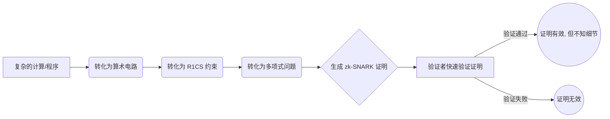
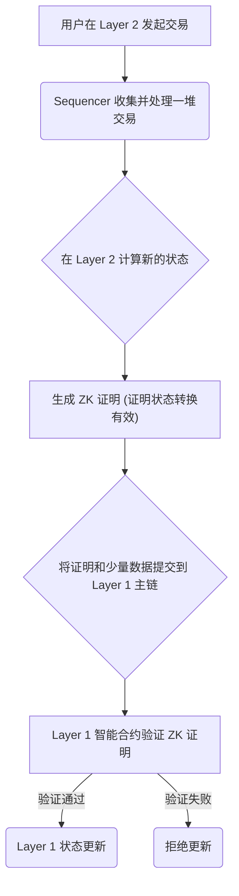

Alright, 老铁们，兄弟姐妹们！今天 Ricky 老哥跟大家唠唠嗑，扒一扒那个在币圈链圈快被吹上天的"零知识证明"（Zero-Knowledge Proof，简称 ZKP）。听着是不是特高大上，感觉下一秒就要起飞割韭菜了？(ಡωಡ) 别慌，坐稳扶好，今天咱就用大白话，把这玩意儿给你说明白了，保证你听完能去跟隔壁广场舞王大妈都解释清楚！

## 一、啥是零知识证明？装X界的核武器

简单来说，零知识证明就是一种让你能向别人**证明你知道某个秘密，但又不透露这个秘密本身**的神奇魔法。

举个栗子？想象一下，你跟朋友吹牛逼，说你知道阿里巴巴那个"芝麻开门"的咒语（假设这玩意儿真实存在哈）。但你又不想把咒语直接告诉他，怕他偷偷跑去把宝藏搬空了。咋办？

零知识证明就派上用场了！你可以当着你朋友的面，走到山洞门口，念出咒语（或者用某种加密方式操作一下），"轰隆"一声，石门打开了！你朋友亲眼看到了结果，**确信你确实知道咒语**，但他自始至终**没听到咒语具体是啥**。

这就是零知识证明的精髓！它有三大法宝：

1. **完备性 (Completeness)**：你要是真知道咒语（拥有知识），就一定能把门打开（证明成功）。你要是知道还打不开，那只能说明你操作不行，或者山洞坏了。
2. **可靠性 (Soundness)**：你要是瞎编乱造想蒙混过关（没有知识），那想把门打开的概率，比你现在出门捡到比特币还低！作弊？门儿都没有！
3. **零知识性 (Zero-Knowledge)**：最骚的操作来了！整个过程，你朋友除了知道"你牛逼，你真知道咒语"之外，关于咒语本身的信息，一丁点儿都得不到！你的小秘密安全得很！

## 二、从"你画我猜"到"甩你一脸证明"

最早的 ZKP 啊，比较墨迹，叫**交互式零知识证明**。就像玩"你画我猜"，证明者（你）和验证者（你朋友）得你来我往好几轮，问答好几次，才能确认你会不会画画（知不知道秘密）。贼麻烦，效率低下，遇上网不好还掉线了呢。

后来大佬们觉得这不行啊，太耽误事儿了！于是就搞出了**非交互式零知识证明 (NIZK)**。这下利索了！你直接生成一个"证明文件"（比如一段加密数据），"啪"一下甩给对方："诺，证明在这，自己看，爱信不信！" 对方拿到证明，自己就能验证真伪，全程不需要跟你哔哔赖赖。效率！懂吗？就像你发朋友圈，你发了，大家看到就行，不用非得等你回复评论才算发布成功。

## 三、当红炸子鸡：zk-SNARK

现在最火、应用最广的 ZKP 流派，就是 **zk-SNARK**。这名字看着吓人，拆开看就好懂了：

* **zk**: Zero-Knowledge，零知识，老朋友了。
* **S**: Succinct，**简洁**！生成的证明文件特别小，不占地方，传输快。不像某些项目，一个证明几 MB，下载半天 (¬_¬)。
* **N**: Non-interactive，**非交互式**，上面刚讲过，甩证明就完事儿。
* **ARK**: Arguments of Knowledge，**知识论证**。听着就很有文化是不是？

简单说，zk-SNARK 就是一种能把**贼复杂的计算过程**（比如"我确实按规矩打包了一万笔交易"）压缩成一个**小小的、非交互式的证明**的技术。这玩意儿简直是区块链扩容、隐私保护的神器！

**那 zk-SNARK 这魔法是怎么变的呢？**

别怕，不讲天书，Ricky 老哥给你打个比方。假设你想向大家证明你会做一道超级复杂的菜，比如佛跳墙，但又不想泄露你的独家秘方。

1. **计算变电路 (Computation to Circuit)**：首先，你得把做佛跳墙的菜谱（计算过程），一步步拆解成最基本的操作，比如"加鲍鱼"、"放海参"、"控制火候"，画成一个流程图（算术电路）。
2. **电路变 R1CS (Circuit to R1CS)**：然后，把这个流程图里的每一步，用一种特殊的"数学约束方程"（Rank-1 Constraint System，R1CS）来表达。你可以想象成给每个步骤定了一套规矩，确保你没偷工减料，比如鲍鱼必须放够多少个。
3. **R1CS 变多项式 (R1CS to Polynomial)**：最后，也是最骚的一步，用数学魔法（比如拉格朗日插值）把这些约束方程，统统转换成**多项式**。为啥要搞成多项式？因为数学家们发现，验证几个多项式在某些点上是否相等，比一步步检查你整个做菜过程要快得多得多！而且，多项式这玩意儿特别擅长"藏东西"，能把你的秘方（原始数据）隐藏起来，只留下一个可以被快速验证的"外壳"（证明）。

为了让大家看得更明白，我画了个简单的图：

## 四、ZKP 背后的数学"靠山"（扫一眼就行，别怕）

* **多项式 (Polynomials)**：为啥老跟它过不去？因为这玩意儿像个数学界的压缩包，能用一个简单的公式代表无限量的信息，而且验证起来贼快。是 ZK 证明里头号打工仔。
* **离散对数 (Discrete Logarithm Problem)**：你可以理解为一种"易守难攻"的数学堡垒。知道钥匙（私钥）开门（计算）贼容易，但只看到锁（公钥和结果），想反推出钥匙？难于上青天！很多加密算法和 ZKP 都靠它来保证安全。
* **同态加密 (Homomorphic Encryption)**：这玩意儿更骚！相当于给你一个"加密保险箱"，你把你的工资条锁进去，你老板可以直接在箱子外面操作（比如计算你的年终奖），但他看不到里面的具体数字！等他算完了，你再用钥匙打开箱子，拿到结果。隐私计算领域的扛把子，有时候也跟 ZKP 配合打 combo。

## 五、ZKP 的"进化史"：从冷宫到顶流

* **1985 年**：三位大佬（Goldwasser, Micali, Rackoff）在论文里提出 ZKP 概念，石破天惊！然后...就没然后了。太理论，太难用，性能太差，被扔进了学术界的冷宫。就像你发明了火箭，但燃料是柴火，飞不起来啊！╮(╯▽╰)╭
* **1990s - 2009 年**：漫长的沉寂期，偶尔有大佬刷刷论文，但没啥实际动静。
* **2010 年后**：转机来了！Groth 等大佬开始给 ZKP "瘦身健体"，搞出了更实用的 zk-SNARK 理论雏形。
* **2013 年**：Pinocchio 协议让 ZKP 勉强能用了，虽然还很慢。
* **2015 年**：**Zcash** 横空出世！第一个把 zk-SNARK 用到加密货币上，搞匿名交易。这下彻底火了！"卧槽，这玩意儿真能用，还能搞钱！" (¬‿¬)
* **2016 年至今**：神仙打架！Groth16 优化了 zk-SNARK，效率大增；Bulletproofs 搞出了不需要"可信设置"（后面有机会再扒这个坑）的证明，还特别短；zk-STARKs 横空出世，号称更快、更安全、抗量子攻击（虽然量子计算机在哪儿还不知道呢...）。最近连国内的科学家们（交大、中科大等）都开始用量子随机数给 NIZK 加 buff 了，卷起来了，家人们！

## 六、ZKP 现在都在哪儿浪？应用场景了解下

**（一）区块链：扩容、隐私两开花**

* **zkRollup (扩容神器)**：现在以太坊堵成狗，交易费贵得能吃顿大餐。zkRollup 就是来解决这个问题的！它把一大堆交易拿到以太坊主链外面（Layer 2）去处理，处理完了生成一个 ZK 证明，"啪"一下扔回主链："嘿，哥们儿，这一万笔交易我处理完了，结果在这儿，保证没问题！" 主链一看证明没毛病，就直接确认了。
  * **好处**：交易速度快 N 倍，手续费便宜到哭！Starknet、zkSync、Scroll、Polygon zkEVM 这些都是搞这个的当红炸子鸡。
  * **简单流程图感受下：**

* **隐私交易 (Zcash 带头大哥)**：不想让别人知道你偷偷买了多少币？或者给谁转了账？Zcash 这种隐私币就用 zk-SNARK 把交易的发送方、接收方、金额全都藏起来，只留一个证明说"这笔交易是合法的"。你的小金库，安全了！
* **存储证明 (Filecoin)**：你把文件存到 Filecoin 网络，矿工需要用 ZK 证明向你保证："大哥，你的文件我确实好好存着呢，没删也没改！" 但他不需要把你的文件内容亮出来。保护了你的数据隐私。
* **可验证计算 / 简洁区块链 (Mina)**：Mina 这项目更绝，用递归 ZK 证明，把整个区块链压缩到只有 22KB！不管有多少交易，验证整个链就跟下载一张小图片一样快。手机都能跑全节点，真正实现"人人可参与"。
* **供应链溯源**：证明你买的这瓶茅台确实是茅台厂出来的，但不用告诉你它是从哪个仓库、哪个环节流出来的。保护商业秘密。
* **匿名投票**：证明你有投票资格，并且你确实投了一票，但没人知道你投给了谁。防止打击报复，保证选举公正。
* **zkPass (隐私身份验证)**：想在网上证明你年满 18 岁才能看某些内容？或者证明你银行存款超过 100 万才能申请某项服务？zkPass 这类工具，让你能生成一个 ZK 证明，对方只知道"你满足条件"，但不知道你的具体生日、身份证号或者银行卡余额。泰裤辣！

**（二）几个明星项目案例瞅瞅**

1. **ZKM (硬核技术流)**
    * **干啥的？** 搞了个 **zkMIPS**，想让 MIPS 这种老芯片架构（很多路由器、嵌入式设备在用）也能跑 ZK 证明。目标宏大：万物皆可 ZK！还搞 **Entangled Rollup**，想让不同链（比如比特币 L2）的资产安全地"纠缠"在一起跨链，不用怕桥被黑。
    * **亮点/槽点**：技术很牛，想从底层改变游戏规则。但 MIPS 生态相对小众，开发难度大，工具链不完善，有点"用爱发电"的感觉。市场竞争也激烈。
2. **zkSync (L2 扩容优等生)**
    * **干啥的？** 以太坊 Layer 2 扩容方案，主打 **zkEVM**，让以太坊上的应用能轻松搬过来，享受低 Gas 高速度。还搞了个 **zkPorter**，数据放链上链下随你选。
    * **亮点/槽点**：融资多，背景强，技术兼容性好。但 L2 赛道卷王太多，Arbitrum、Optimism 这些前辈压着，后面 Starknet、Scroll 追着，生态建设和用户体验还得加把劲。
3. **Mina (小而美的代表)**
    * **干啥的？** 主打"**简洁区块链**"，整个链就 22KB，手机都能跑全节点。靠的是递归 ZK 证明。还搞 **zkApps**，想做带隐私保护的去中心化应用。
    * **亮点/槽点**：理念非常性感，解决了区块链臃肿问题，真正走向去中心化。但 ZK 技术本身有门槛，生态应用还比较早期，需要更多杀手级应用来吸引用户。

## 七、总结

好了，老铁们，今天关于零知识证明的课就上到这里。

总的来说，ZKP 这玩意儿，就是个**用数学魔法实现的"既要...又要..."的神器**：既要证明我知道，又要隐藏我知道啥；既要过程安全可信，又要结果简洁高效。从象牙塔里的理论，到 Zcash 的一炮而红，再到如今 Layer 2 扩容、隐私计算、跨链等……
